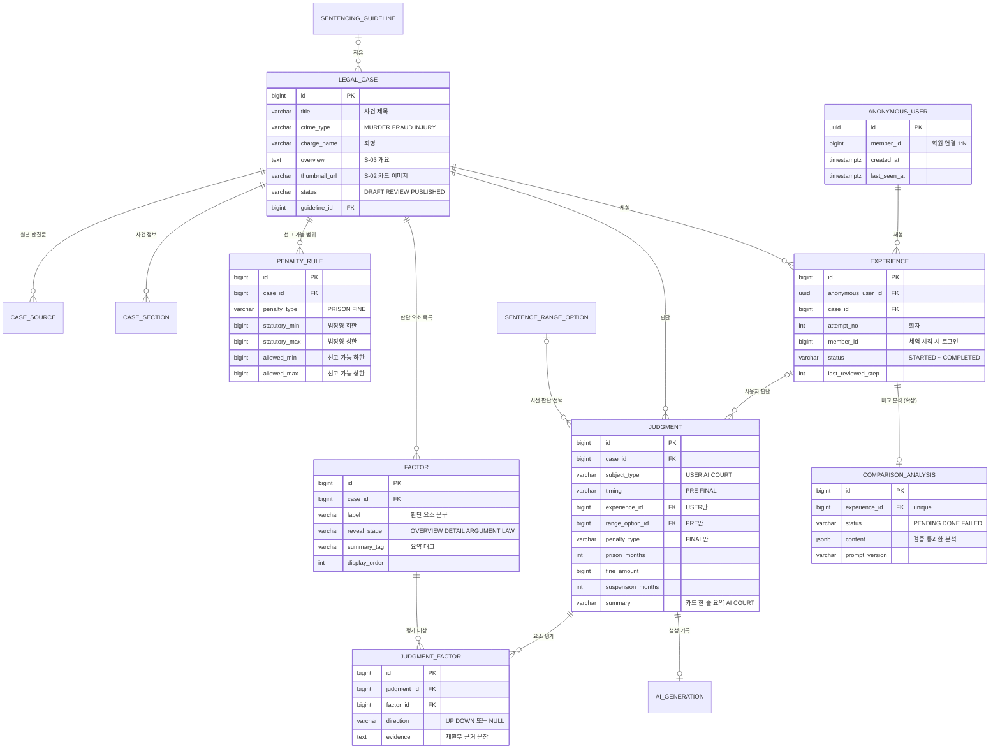

**작성 이력**

| 버전 | 날짜 | 내용 |
| --- | --- | --- |
| **v0.1** | **2026-09-28** | **초안** • 테이블 11개 •  관계도 •  컬럼 정의 •  상태 전이 규칙 •  결정 필요 사항 |
| v1.0 | 2026-09-28 | 결정 사항 확정 • 결정 #1~#6 확정(4장) • judgment 구현 규칙 추가(7장) • experience에 attempt_no · member_id 추가 및 유니크 제약 변경(재체험·회원 연결 대비) • penalty_rule을 법정형 / 선고 가능 범위로 분리 |
| v1.1 | 2026-09-28 | 비교 분석 실시간 생성(시퀀스 v0.2 안 B) 반영 • comparison_analysis 테이블 추가(확장 단계, 체험당 1개) • 관계도 · 서버 규칙 갱신 |
| **v1.3** | **2026-09-29** | **문서 정합성 점검 결정 반영 (COMMON-4)** • DB를 PostgreSQL로 확정(기술 스택 2장): 타입을 `jsonb` · `timestamptz`로, MySQL 관련 문구 삭제 • `judgment.references` → `reference_tags` (SQL 예약어 회피) • 무죄(`NOT_GUILTY`) MVP 제외 • 경합범 서비스 제외에 따라 예시 데이터(6장)를 단일 범행 사건으로 교체 • `legal_case.thumbnail_url` · `deidentified_items`(확장), `factor.summary_tag`, `judgment.summary` 추가, 범죄 분류명은 코드 상수 |
| v1.2 | 2026-09-28 | 전체 문서 교차 검토 반영 • case_section.stage에 SUMMARY 추가 · 섹션 •  출처 명시, 공개 판단 유일 조건을 (case_id, subject_type)별로 정정 • 형벌 종류별 CHECK 제약 추가 • judgment.references 추가 (v1.3에서 `reference_tags`로 변경) • 선고 가능 하한 정의 명확화(법률상 감경 + 작량감경) · 벌금 예시 하한 25,000원 • last_reviewed_step 규칙 • 선택 FK 관계선 표기 • 서버 규칙 표 보완 |

---

## 1. 설계 원칙

1. **판단은 하나의 테이블로.** 사용자의 사전 판단·최종 판결, AI 판결, 재판부 판결을 모두 `judgment` 한 테이블에 `subject_type` + `timing`으로 구분해 저장한다(DR-1, DR-3). 배심원 의견 등은 `subject_type` 값만 추가하면 된다.
2. **판단 요소 기록도 하나의 형식으로.** 누가 판단했든 `judgment_factor` 한 테이블에 같은 형식(요소 · 방향)으로 저장한다(DR-2). 그래서 비교 매트릭스는 조회 한 번으로 만들 수 있다.
3. **사건마다 달라지는 내용은 유연하게.** 범죄 유형별로 필드가 달라지는 사건 정보(피해 금액, 범행 기간 등)는 컬럼으로 고정하지 않고 `case_section`의 본문 + JSON 데이터로 담는다.
4. **진행 상태는 서버가 강제한다.** 체험 진행은 `experience.status`로 관리하고, 상태는 앞으로만 이동한다(IA 9장).
5. **원본 판결문 정보는 내부 전용.** 사건번호·법원명 등은 `case_source`에 따로 두고 사용자 응답에는 절대 포함하지 않는다(REQ-074, FR-5-3).
6. **나중에 열 기능은 컬럼만 미리.** 재체험, 회원 연결, 배심원 관점처럼 MVP 이후 기능은 스키마를 바꾸지 않고 켤 수 있도록 컬럼과 값만 준비해 둔다.

---

## 2. 관계도

---

## 3. 테이블 정의

### 3-1. 사건 콘텐츠 (팀이 등록)

#### `legal_case` — 사건

> `case`는 SQL 예약어라 `legal_case`로 둔다.
>

| 컬럼 | 타입 | 필수 | 설명 | 관련 |
| --- | --- | --- | --- | --- |
| id | bigint PK | ✓ |  |  |
| title | varchar(100) | ✓ | 사건 제목 | REQ-006 |
| crime_type | varchar(20) | ✓ | `MURDER` / `FRAUD` / `INJURY` | FR-1-2 |
| charge_name | varchar(100) | ✓ | 죄명 (예: 사기) | REQ-015 |
| short_intro | varchar(200) | ✓ | 목록 카드용 짧은 소개 | REQ-006 |
| keywords | jsonb |  | 목록 카드용 중립 키워드 배열 | FR-1-5 |
| difficulty | varchar(10) |  | `LOW` / `MID` / `HIGH` | FR-1-5 |
| estimated_minutes | int |  | 예상 소요 시간 | FR-1-5 |
| overview | text | ✓ | S-03 사건 개요 (뉴스 수준, 중립 표현) | REQ-015, 094 |
| thumbnail_url | varchar(300) |  | S-02 사건 카드 이미지 경로 (v1.3). 없으면 화면이 범죄 유형별 기본 이미지를 쓴다 | REQ-006 |
| deidentified_items | jsonb |  | (확장) 비식별화한 항목 종류 배열 (예: `["인명", "지명", "사건번호", "업체명"]`). 원래 값은 넣지 않는다 (v1.3) | FR-5-2, REQ-055 |
| applied_law | varchar(200) | ✓ | 적용 법조문 (예: 형법 제347조) — 고정 입력값 | REQ-042 |
| statutory_penalty_text | varchar(200) | ✓ | 법정형 안내 문구 (예: 10년 이하의 징역 또는 2천만 원 이하의 벌금) | REQ-023 |
| recommended_min_months | int |  | 권고 형량 하한 (개월) | REQ-034 |
| recommended_max_months | int |  | 권고 형량 상한 (개월) | REQ-034 |
| recommended_basis | text |  | 권고 범위 산출 근거 문구 | REQ-035 |
| guideline_id | bigint FK |  | 적용 양형기준 버전 | REQ-080 |
| incident_date | date |  | 사건 발생일 (양형기준 버전 판단 근거) | FR-3-5-1 |
| status | varchar(20) | ✓ | `DRAFT` / `REVIEW` / `PUBLISHED`. `PUBLISHED`만 사용자에게 노출 | REQ-047, 075 |
| published_at | timestamptz |  |  |  |
| created_at, updated_at | timestamptz | ✓ |  |  |
- 권고 범위는 MVP에서 팀이 계산해 입력한 값을 그대로 쓴다. 자동 계산 로직은 확장 단계(결정 #4).
- 화면에 보이는 범죄 분류명(예: "사기 / **재산범죄**")은 컬럼으로 두지 않고 `crime_type`별 코드 상수로 둔다(`MURDER` → 생명범죄, `FRAUD` → 재산범죄, `INJURY` → 신체범죄). API는 `crimeCategoryLabel`로 내려준다(v1.3).

#### `case_section` — 사건 정보 섹션

S-04 · S-05에 보여 줄 사건 정보를 섹션 단위로 저장한다(결정 #3). S-03 개요와 S-04 섹션 ①은 `legal_case.overview` 하나를 함께 쓰고, 이 테이블에 중복 저장하지 않는다.

| 컬럼 | 타입 | 필수 | 설명 |
| --- | --- | --- | --- |
| id | bigint PK | ✓ |  |
| case_id | bigint FK | ✓ |  |
| stage | varchar(20) | ✓ | 화면 단계: `DETAIL` / `ARGUMENT` / `LAW` / `SUMMARY`(S-05 전용) |
| section_type | varchar(30) | ✓ | 섹션 종류 (아래 표) |
| title | varchar(100) |  | 섹션 라벨 (예: 주요 사실관계) |
| content | text |  | 본문 |
| data | jsonb |  | 구조화 데이터 (피해 결과 카드 값, 용어 설명 목록 등) |
| display_order | int | ✓ | 같은 단계 안에서의 순서 |

| section_type | stage | 내용 | data 예시 |
| --- | --- | --- | --- |
| `FACTS` | DETAIL | 주요 사실관계 | — |
| `DAMAGE` | DETAIL | 피해 결과 요약 카드 | `[{"label":"피해자 수","value":"1명"}, {"label":"피해 금액","value":"4,500만 원"}, ...]` |
| `DEFENDANT` | DETAIL | 피고인 관련 주요 사실 | — |
| `SETTLEMENT` | DETAIL | 합의 · 피해 회복 | — |
| `PROSECUTOR` | ARGUMENT | 검사 측 주장 | — |
| `DEFENSE` | ARGUMENT | 피고인 · 변호인 측 주장 | — |
| `LAW_TERM` | LAW | 법률 · 양형기준 용어 설명 | `[{"term":"기본영역","desc":"..."}]` |
| `SUMMARY` | SUMMARY | S-05 핵심 사실 요약 | `["지인 1명에게 1회 4,500만 원 송금받음", ...]` |
- 적용 법률 · 법정형 · 권고 범위는 `legal_case` 컬럼에서, 선고 가능 범위는 `penalty_rule`에서 꺼내 LAW 단계에 함께 보여 준다.
- 범죄 유형마다 섹션 종류가 달라지면 `section_type` 값만 추가한다.

#### `penalty_rule` — 형벌별 법정형과 선고 가능 범위

S-06에서 보여 줄 형벌 선택지, 그리고 **선고 가능 범위 밖 판결을 막는 기준**이다(FR-3-3 ②).

| 컬럼 | 타입 | 필수 | 설명 |
| --- | --- | --- | --- |
| id | bigint PK | ✓ |  |
| case_id | bigint FK | ✓ |  |
| penalty_type | varchar(20) | ✓ | `PRISON` / `FINE`. 무죄(`NOT_GUILTY`)는 MVP에서 뺐다(v1.3, 요구사항 15장) |
| statutory_min | bigint |  | 법정형 하한 (징역: 개월, 벌금: 원). 없으면 NULL |
| statutory_max | bigint |  | 법정형 상한 |
| allowed_min | bigint |  | **선고 가능 하한** — 법정형 하한에 사실관계로 인정되는 법률상 감경(자수 · 심신미약 등)과 작량감경(재판상 감경, 형법 제53조)을 모두 적용했을 때의 값 |
| allowed_max | bigint |  | **선고 가능 상한** — 법정형 상한. 누범 등 사실관계로 정해지는 가중이 있으면 반영한 값 |
| allowed_basis | varchar(300) |  | 선고 가능 범위 산출 근거 (예: 작량감경 시 하한 1/2) |
| suspension_allowed | boolean | ✓ | 이 형벌에 집행유예 입력을 보여 줄지 |
| display_order | int | ✓ |  |
- 예 1 (사기, 조문상 하한 없음): `PRISON` 법정형 NULL ~ 120 / 선고 가능 1 ~ 120, `FINE` 법정형 NULL ~ 20,000,000 / 선고 가능 25,000 ~ 20,000,000
    - `statutory_min`이 NULL이면 조문에 하한이 없다는 뜻이다. 이때도 형법의 일반 하한(징역 1개월, 제42조 / 벌금 5만 원, 제45조)이 적용된다.
    - 징역은 1개월보다 낮게 선고할 수 없어 1이다. 벌금은 감경하면 5만 원 미만으로 할 수 있고(제45조 단서) 감경 시 1/2이 되므로(제55조 제1항 제6호) 25,000이다. **사건 등록 시 법조문으로 다시 확인한다.**
- 예 2 (법정형 1년 이상 10년 이하, 법률상 감경 사유 없음): `PRISON` 법정형 12 ~ 120 / 선고 가능 6 ~ 120 (작량감경 1/2). 법률상 감경 사유도 있으면 3 ~ 120
- **재판부가 실제로 감경했는지와 관계없이** 가장 넓은 범위를 쓴다. 판결 전 화면에서 재판부의 감경 여부가 드러나지 않게 하기 위해서다.
- **경합범 가중(형법 제38조)은 반영하지 않는다.** 경합범(같은 죄를 여러 번 저지른 동종 경합범 포함) 사건은 서비스 대상에서 뺐으므로(REQ-081, v1.3) 상한은 단일 범행 기준이다.
- MVP는 팀이 판결문 · 법조문을 확인해 계산한 값을 입력한다. 자동 계산은 확장 단계.
- 집행유예 가능 조건(선고형 3년 이하 징역 또는 500만 원 이하 벌금, 기간 1~5년, 형법 제62조 본문)은 법 규정이라 테이블이 아니라 코드 상수로 둔다. 같은 조 단서의 결격 사유(금고 이상 형 확정 후 집행 종료 · 면제 뒤 3년 안에 범한 죄)는 사건마다 다르므로 `suspension_allowed`에 반영해 입력한다.

#### `factor` — 사건별 판단 요소 목록

사용자 · AI · 재판부가 함께 쓰는 공통 목록(FR-3-4).

| 컬럼 | 타입 | 필수 | 설명 | 관련 |
| --- | --- | --- | --- | --- |
| id | bigint PK | ✓ |  |  |
| case_id | bigint FK | ✓ |  | REQ-031 |
| label | varchar(100) | ✓ | 판단 요소 문구 (예: 피해 금액이 4,500만 원이다) | REQ-076 |
| pre_label | varchar(100) |  | 사전 판단용 짧은 문구 (예: 피해 금액이 수천만 원이다). `OVERVIEW` 요소만 | REQ-093 |
| reveal_stage | varchar(20) | ✓ | 처음 알게 되는 단계: `OVERVIEW` / `DETAIL` / `ARGUMENT` / `LAW` | REQ-095 |
| summary_tag | varchar(20) | ✓ | 요약 태그 (v1.3). 요소를 묶는 짧은 분류명 (예: `피해 규모`, `범행 방식`, `피해 회복`, `피해자 의사`, `반성`, `전력`). S-09 "내 판결" 한 줄 요약의 규칙 문장에 쓴다 | REQ-060 |
| display_order | int | ✓ |  |  |
- `summary_tag`는 사건별로 팀이 붙인다. 같은 사건 안에서 여러 요소가 같은 태그를 가질 수 있다. 태그 문구도 판단 요소와 같이 중립적으로 쓴다(FR-3-4).

#### `case_source` — 원본 판결문 (내부 전용)

| 컬럼 | 타입 | 필수 | 설명 |
| --- | --- | --- | --- |
| id | bigint PK | ✓ |  |
| case_id | bigint FK | ✓ |  |
| court_level | varchar(20) | ✓ | `FIRST` / `APPEAL` / `SUPREME` |
| case_number | varchar(50) | ✓ | 사건번호 |
| court_name | varchar(50) |  | 법원명 |
| decided_at | date |  | 선고일 |
| is_final | boolean | ✓ | 최종 확정 판결 여부 (REQ-054) |
| source_org | varchar(50) | ✓ | 출처 기관 (사용자에게 노출 가능한 유일한 컬럼) |
| original_text | text |  | 판결문 원문 또는 저장 위치 |
| note | text |  | 가공 · 검수 메모 |
- 1심과 항소심 판결문을 모두 쓰는 사건은 행을 2개 둔다(FR-2-2).

#### `sentencing_guideline` — 양형기준 버전

| 컬럼 | 타입 | 필수 | 설명 |
| --- | --- | --- | --- |
| id | bigint PK | ✓ |  |
| crime_category | varchar(50) | ✓ | 예: 사기범죄 |
| version_name | varchar(50) | ✓ | 예: 2024 개정 |
| effective_date | date | ✓ | 시행일 |
| source_url | varchar(300) |  |  |

#### `sentence_range_option` — 사전 판단 형량 구간

S-03의 객관식 선택지. 범죄 유형별로 정의한다(FR-2-8).

| 컬럼 | 타입 | 필수 | 설명 |
| --- | --- | --- | --- |
| id | bigint PK | ✓ |  |
| crime_type | varchar(20) | ✓ |  |
| label | varchar(50) | ✓ | 예: 실형 3년 이상 ~ 5년 미만 |
| kind | varchar(20) | ✓ | `FINE` / `SUSPENDED` / `PRISON` |
| min_months | int |  | 실형 구간 하한 |
| max_months | int |  | 실형 구간 상한 |
| display_order | int | ✓ |  |
- `kind`와 개월 범위가 있어야 S-09에서 "처음 생각보다 가벼운/무거운 판결"을 계산할 수 있다.

### 3-2. 사용자 체험 (시스템이 기록)

#### `anonymous_user` — 익명 사용자

| 컬럼 | 타입 | 필수 | 설명 |
| --- | --- | --- | --- |
| id | uuid PK | ✓ | 브라우저에 저장하는 익명 ID |
| member_id | bigint |  | 이 브라우저에서 로그인한 회원. 회원 1명에 익명 ID 여러 개가 연결될 수 있다(1:N). MVP에서는 비워 둠 |
| created_at | timestamptz | ✓ |  |
| last_seen_at | timestamptz | ✓ |  |
- 회원 기능(이후 단계)에서 로그인하는 순간 해당 브라우저의 `member_id`를 채운다. 그러면 비로그인 때 한 체험이 회원 기록으로 이어진다.
- `member` 테이블은 회원 기능 설계 때 추가한다.

#### `experience` — 체험 (익명 사용자 × 사건 × 회차)

IA 9장의 진행 상태를 저장한다.

| 컬럼 | 타입 | 필수 | 설명 |
| --- | --- | --- | --- |
| id | bigint PK | ✓ |  |
| anonymous_user_id | uuid FK | ✓ |  |
| case_id | bigint FK | ✓ |  |
| attempt_no | int | ✓ | 이 사건의 몇 번째 체험인지. 기본값 1. **MVP에서는 항상 1** |
| member_id | bigint |  | 체험을 **시작할 때** 로그인 상태였다면 회원 ID. MVP에서는 비워 둠 |
| status | varchar(30) | ✓ | `STARTED` / `PRE_JUDGED` / `REVIEWING` / `REVIEWED` / `VERDICT_CONFIRMED` / `AI_REVEALED` / `COMPLETED` |
| last_reviewed_step | int | ✓ | S-04에서 확인을 마친 마지막 섹션 번호 (0 ~ 4). 기본값 0(`STARTED`). 사전 판단 제출 시 1(섹션 ① 개요는 S-03에서 본 것으로 처리), 섹션 ② ~ ④ 확인 시 2 ~ 4. 새로고침 복원용 |
| started_at | timestamptz | ✓ |  |
| pre_judged_at | timestamptz |  |  |
| reviewed_at | timestamptz |  |  |
| verdict_confirmed_at | timestamptz |  |  |
| ai_revealed_at | timestamptz |  |  |
| completed_at | timestamptz |  |  |
| updated_at | timestamptz | ✓ |  |
- **유니크 제약**: (`anonymous_user_id`, `case_id`, `attempt_no`)
- MVP에서는 `attempt_no = 1`만 만든다. 같은 브라우저에서 이미 체험을 시작한 사건에 들어오면 새 체험을 만들지 않고 기존 체험의 진행 단계로 보낸다. 완료(`COMPLETED`)한 사건이면 S-09 결과 화면으로 보낸다.
- 통계와 참여자 비교에는 `attempt_no = 1`인 체험만 쓴다. 두 번째 체험부터는 실제 판결을 이미 알고 있는 상태이기 때문이다.
- 체험 당시 로그인 여부 구분:

| 상황 | anonymous_user.member_id | experience.member_id | 해석 |
| --- | --- | --- | --- |
| 비로그인으로 체험, 가입 전 | 비어 있음 | 비어 있음 | 익명 체험 |
| 비로그인으로 체험 → 나중에 로그인 | 채워짐 | 비어 있음 | 로그인 전에 한 체험 (회원 기록으로 이어짐) |
| 로그인한 상태로 체험 | 채워짐 | 채워짐 | 로그인 후 체험 |

### 3-3. 판단 (사용자 · AI · 재판부 공통)

#### `judgment` — 판단

| 컬럼 | 타입 | 필수 | 설명 |
| --- | --- | --- | --- |
| id | bigint PK | ✓ |  |
| case_id | bigint FK | ✓ |  |
| subject_type | varchar(20) | ✓ | `USER` / `AI` / `COURT` (이후 `JURY` 등) |
| timing | varchar(10) | ✓ | `PRE` / `FINAL`. `PRE`는 `USER`만 |
| experience_id | bigint FK |  | `USER`일 때만 |
| range_option_id | bigint FK |  | `PRE`일 때만 (사전 판단 형량 구간) |
| penalty_type | varchar(20) |  | `PRISON` / `FINE`. `FINAL`일 때 필수 (무죄는 MVP 제외, v1.3) |
| prison_months | int |  | 징역 개월 |
| fine_amount | bigint |  | 벌금 (원) |
| suspension_months | int |  | 집행유예 기간 (개월). 없으면 NULL |
| extra_dispositions | jsonb |  | 부가 처분 (예: `[{"type":"COMMUNITY_SERVICE","value":"80시간"}]`). 주로 `COURT` |
| summary | varchar(100) |  | S-09 판결 카드의 한 줄 요약 (v1.3). AI · COURT는 팀이 입력. USER는 저장하지 않고 서버가 `factor.summary_tag`로 규칙 문장을 만들어 응답한다(API 판결 응답 공통 형식) |
| reasoning | text |  | 판결 이유 요약 (AI · COURT) |
| plain_explanation | text |  | 쉬운 설명 (COURT) |
| excerpt | text |  | 판결문 발췌 (COURT, 비식별화 적용) |
| free_opinion | text |  | 자유 의견 (USER, 비교 대상 아님) |
| reference_tags | jsonb |  | 참고 자료 태그 (AI, 예: `["형법 제347조", "사기범죄 양형기준", "유사 판례 5건"]`). S-07에 표시 (v1.2 추가, v1.3에서 `references` → `reference_tags`: `REFERENCES`는 SQL 예약어) |
| is_published | boolean | ✓ | AI · COURT는 검수 후 `true`만 노출. USER는 항상 `true` |
| created_at | timestamptz | ✓ |  |

**제약 조건**

| 제약 | 내용 | 지키는 규칙 |
| --- | --- | --- |
| 유니크 (`experience_id`, `timing`) | 한 체험에 사전 판단 1개, 최종 판결 1개 | 수정·재제출 불가 (IA 결정 #4) |
| CHECK: `timing = PRE` | `subject_type = USER`, `range_option_id` 필수, `penalty_type` · `prison_months` · `fine_amount` · `suspension_months`는 NULL | 사전 판단 형식 |
| CHECK: `timing = FINAL` | `penalty_type` 필수, `range_option_id`는 NULL | 최종 판결 형식 |
| CHECK: 형벌 종류별 값 (v1.2) | `PRISON` → `prison_months` 필수 · `fine_amount` NULL / `FINE` → `fine_amount` 필수 · `prison_months` NULL (v1.3: `NOT_GUILTY` 조건 삭제) | AI · COURT 판결을 SQL로 넣을 때도 형식 보장 |
| CHECK: 주체와 체험 (v1.2) | `subject_type = USER` ⇔ `experience_id` NOT NULL | 사용자 판단은 체험에 속함 |
| 공개 판단 1개 | `subject_type` ∈ {AI, COURT} 이고 `is_published = true`인 행은 (`case_id`, `subject_type`)별로 1개 — 사건마다 공개 AI 판결 1개, 공개 실제 판결 1개. PostgreSQL 부분 유니크 인덱스로 구현(기술 스택 2장 `uk_judgment_published`) | 모든 사용자에게 같은 AI 판결 (REQ-046) |
| 수정 없음 | `USER` 판단은 INSERT만 하고 UPDATE API를 두지 않음 | IA 결정 #4 |
| 선고 가능 범위 | `USER` `FINAL` 저장 시 `penalty_rule.allowed_min` ~ `allowed_max` 밖이면 거절 (서비스 로직) | FR-3-3 ② |

#### `judgment_factor` — 판단 요소 평가

| 컬럼 | 타입 | 필수 | 설명 |
| --- | --- | --- | --- |
| id | bigint PK | ✓ |  |
| judgment_id | bigint FK | ✓ |  |
| factor_id | bigint FK | ✓ |  |
| direction | varchar(10) |  | `UP` / `DOWN`. 사전 판단(`PRE`)은 방향 없이 NULL |
| evidence | text |  | 재판부 판단의 근거 문장 (COURT, REQ-077) |
- **유니크 제약**: (`judgment_id`, `factor_id`)
- **행이 없으면 "고려하지 않음"(—)으로 본다**(결정 #1). 요구사항 DR-2의 "고려 여부"는 행의 존재 여부로 표현한다.
- 사전 판단(`PRE`)에는 `reveal_stage = OVERVIEW`인 요소만 저장할 수 있다.

#### `ai_generation` — AI 판결 생성 기록 (확장 단계)

AI 판결 1건을 어떤 조건으로 만들었는지 남긴다(REQ-047, 079). MVP에서는 오프라인으로 생성한 결과를 넣을 때 최소 항목만 채운다.

| 컬럼 | 타입 | 필수 | 설명 |
| --- | --- | --- | --- |
| id | bigint PK | ✓ |  |
| judgment_id | bigint FK, unique | ✓ | 대상 AI 판단 |
| model_name | varchar(50) | ✓ |  |
| prompt_version | varchar(30) | ✓ |  |
| input_snapshot | jsonb |  | AI에 넣은 입력 (실제 판결이 없는지 검증용, REQ-041) |
| raw_output | jsonb |  | 모델 원본 출력 |
| review_status | varchar(20) | ✓ | `PENDING` / `APPROVED` / `REJECTED` |
| reviewed_by | varchar(50) |  | 검수자 |
| reviewed_at | timestamptz |  |  |
| created_at | timestamptz | ✓ |  |
- 모델·프롬프트가 바뀌면 새 `judgment` + 새 `ai_generation`을 만들고, 검수 후 공개 판단을 교체한다. 기존 행은 지우지 않는다(REQ-079).

#### `comparison_analysis` — 세 판결 비교 분석 (확장 단계, v1.1)

체험 1건의 세 판결을 AI가 비교한 결과를 저장한다(FR-6-3). 사용자 판결이 체험마다 다르므로 **체험별로 실시간 생성**한다(시퀀스 8장). AI 판결(`ai_generation`)과 달리 공개 전 검수가 없으므로, 서버 검증을 통과한 결과만 `DONE`으로 저장한다.

| 컬럼 | 타입 | 필수 | 설명 |
| --- | --- | --- | --- |
| id | bigint PK | ✓ |  |
| experience_id | bigint FK, unique | ✓ | 대상 체험. 체험당 1개 |
| status | varchar(20) | ✓ | `PENDING`(생성 중) / `DONE`(검증 통과) / `FAILED`(검증 실패 · 오류 · 시간 초과 → 화면은 규칙 문장 유지) |
| content | jsonb |  | 검증을 통과한 분석. 항목마다 근거 요소 ID(`factor.id`) 포함 |
| fail_reason | varchar(30) |  | `INVALID_FACTOR` / `FORBIDDEN_EXPRESSION` / `INVALID_FORMAT` / `TIMEOUT` / `API_ERROR` |
| model_name | varchar(50) | ✓ |  |
| prompt_version | varchar(30) | ✓ |  |
| input_snapshot | jsonb |  | AI에 넣은 입력 (사건 원문 · 판결문 전문이 없는지 점검용) |
| raw_output | jsonb |  | 모델 원본 출력 (실패 원인 분석 · 샘플 점검용) |
| created_at | timestamptz | ✓ | 생성 시작 (S-08 진입, `AI_REVEALED`) |
| completed_at | timestamptz |  | `DONE` · `FAILED`가 된 시각 |
- 행은 실제 판결 공개(`AI_REVEALED`) 시 `PENDING`으로 만들고, 생성 작업이 끝나면 `DONE` 또는 `FAILED`로 바꾼다. 유니크 제약으로 동시 요청이 와도 한 번만 생성한다.
- `FAILED`는 자동으로 다시 만들지 않는다(MVP와 같은 규칙 문장이 보이므로 체험은 정상). 재시도 정책은 기술 설계에서 정한다.
- 비교 분석은 `COMPLETED` 상태에서만 응답한다.
- `content.perspectives.USER`는 확장 단계의 AI "내 판결" 요약이다(REQ-062, v1.3). `DONE`이면 S-09 내 판결 카드의 한 줄 요약(MVP: `summary_tag` 규칙 문장)을 이 값으로 바꾼다. 따로 테이블을 두지 않고 이 행에 함께 저장한다.

---

## 4. 결정 사항 (v1.0 확정)

| # | 항목 | 결정 | 비고 |
| --- | --- | --- | --- |
| 1 | "고려하지 않음" 저장 방식 | 고려한 요소만 `judgment_factor` 행으로 저장. 행이 없으면 "—" | "명시적으로 고려하지 않음"을 구분할 필요가 생기면 `considered` 컬럼 추가 |
| 2 | 사전 판단 저장 위치 | `judgment`에 `timing = PRE`로 저장 | 빈 컬럼은 CHECK 제약과 구현 규칙으로 관리 (7장) |
| 3 | 사건 정보 저장 방식 | `case_section` (본문 + JSON) | 대표 판례 확정 후 필요하면 재검토 |
| 4 | 권고 형량 범위 저장 위치 | `legal_case` 컬럼에 팀이 계산한 값 입력 | 자동 계산은 확장 단계. 선고 가능 범위(`penalty_rule`)도 같은 방식 |
| 5 | 사건당 체험 횟수 | MVP는 1회 (같은 브라우저 기준). `attempt_no` · `member_id`로 재체험 · 회원 연결 대비 | 통계는 `attempt_no = 1`만 사용 |
| 6 | JSON 컬럼 사용 | 사용 (keywords, deidentified_items, data, extra_dispositions, reference_tags, input_snapshot, raw_output, content) | **v1.3: DB는 PostgreSQL로 확정**(기술 스택 2장). JSON 컬럼은 `jsonb`, 시각은 `timestamptz` |

### 선고 가능 범위 (함께 확정)

| 항목 | 결정 |
| --- | --- |
| 범위 밖 판결 | **확정 불가** — 화면에서 확정 버튼 비활성 + 서버에서 저장 거절 |
| 기준 | 법정형이 아니라 **선고할 수 있는 가장 넓은 범위** (`penalty_rule.allowed_min` ~ `allowed_max`) |
| 하한 | 법정형 하한에 사실관계로 인정되는 법률상 감경과 작량감경(재판상 감경)을 모두 적용한 값 |
| 상한 | 법정형 상한. 누범처럼 사실관계로 정해지는 가중이 있으면 반영 |
| 이유 | 재판부가 실제로 감경했는지가 판결 전에 드러나지 않게 하고, 나중에 가중·감경 로직을 붙이기 쉽게 하기 위해 |
| 주의 | 계산 규칙은 사건 등록 시 판결문 · 법조문 · 양형기준으로 다시 확인한다 |

---

## 5. 서버 규칙과 테이블의 연결

IA 9장의 규칙을 어느 테이블·제약이 책임지는지 정리한다.

| 규칙 | 담당 |
| --- | --- |
| 상태는 앞으로만 이동 | `experience.status` 전이를 서비스 로직에서 검증 (이전 상태로 되돌리는 API 없음) |
| 사전 판단은 한 번만 | `status = STARTED`일 때만 저장 허용 + 유니크 (`experience_id`, `timing`) |
| 최종 판결은 한 번만 | `status = REVIEWED`일 때만 저장 허용 + 유니크 (`experience_id`, `timing`) |
| 선고 가능 범위 밖 판결 거절 | `penalty_rule.allowed_min` ~ `allowed_max` 검증 |
| AI 판결은 확정 후에만 | `status ≥ VERDICT_CONFIRMED`일 때만 AI `judgment` 응답 |
| 비교 분석 체험당 1회 생성 (확장) | `comparison_analysis.experience_id` 유니크, `COMPLETED`일 때만 응답 |
| 실제 판결은 AI 다음에 | `status ≥ AI_REVEALED`일 때만 COURT `judgment` 응답 |
| 사전 판단은 비교 화면에서만 | `status = COMPLETED`일 때만 `PRE` 판단 응답 |
| 새로고침 복원 | `experience.status` + `last_reviewed_step` |
| 섹션 확인 순서 (서버 강제) | `last_reviewed_step + 1`번 섹션만 확인 가능. 잠긴 섹션 본문은 응답하지 않음 (REQ-019) |
| 체험 중복 방지 | 같은 (`anonymous_user_id`, `case_id`)의 체험이 있으면 새로 만들지 않고 기존 체험으로 이동. 완료했으면 S-09 |
| 원본 판결문 비노출 | `case_source`는 사용자 API에서 조회하지 않음 (`source_org`만 예외) |
| 검수된 결과만 노출 | `legal_case.status = PUBLISHED`, `judgment.is_published = true` |

---

## 6. 예시 데이터 (지인 투자금 편취 사건, v1.3)

단일 범행 사기 사건을 설명용으로 가정한 예시다(피해자 1명, 1회 송금 4,500만 원). v1.2까지의 예시(중고거래 반복 사기, 피해자 37명)는 **경합범이라 서비스 대상에서 제외**되어(REQ-081) v1.3에서 바꿨다. 와이어프레임 v2.1은 아직 예전 예시 기준이다. 권고 범위(징역 6개월 ~ 1년 6개월, 일반사기 제1유형 기본영역)와 아래 값은 **대표 판례 등록 시 팀이 다시 계산한다.**

**penalty_rule**

| penalty_type | statutory_min | statutory_max | allowed_min | allowed_max | suspension_allowed |
| --- | --- | --- | --- | --- | --- |
| PRISON | NULL | 120 | 1 | 120 | true |
| FINE | NULL | 20,000,000 | 25,000 | 20,000,000 | true |

→ 12년(144개월)을 입력하면 `allowed_max` 120을 넘으므로 확정 불가(S-06c). 단일 범행이라 경합범 가중이 없다.

**factor**

| id | label | reveal_stage | summary_tag |
| --- | --- | --- | --- |
| 1 | 피해 금액이 4,500만 원이다 | OVERVIEW | 피해 규모 |
| 2 | 10년 가까이 알고 지낸 지인 관계를 이용했다 | OVERVIEW | 범행 방식 |
| 3 | 처음부터 투자할 생각 없이 받은 돈을 생활비와 빚 갚는 데 썼다 | DETAIL | 범행 방식 |
| 4 | 재판 중 피해 금액 중 1,500만 원을 갚았다 | DETAIL | 피해 회복 |
| 5 | 피해자가 처벌을 원한다 | DETAIL | 피해자 의사 |
| 6 | 수사 단계부터 범행을 인정하고 반성했다 | DETAIL | 반성 |
| 7 | 형사처벌 전력이 없다 | DETAIL | 전력 |

`pre_label`: 1 = "피해 금액이 수천만 원이다", 2 = "오래 알고 지낸 사이를 이용했다"

**judgment**

| id | subject_type | timing | experience_id | range_option_id | penalty_type | prison_months | suspension_months | summary |
| --- | --- | --- | --- | --- | --- | --- | --- | --- |
| 10 | USER | PRE | 100 | (실형 3년 미만) | NULL | NULL | NULL | NULL |
| 11 | USER | FINAL | 100 | NULL | PRISON | 18 | 36 | NULL (응답 시 규칙 문장 생성) |
| 20 | AI | FINAL | NULL | NULL | PRISON | 12 | 24 | 피해 규모와 변제 · 반성을 함께 저울질한 판단 |
| 30 | COURT | FINAL | NULL | NULL | PRISON | 10 | 24 | 변제와 반성, 초범인 점을 크게 본 판단 |

재판부 `extra_dispositions`: `[{"type":"COMMUNITY_SERVICE","value":"80시간"}]`

**judgment_factor**

| judgment_id | factor_id | direction |
| --- | --- | --- |
| 10 | 1, 2 | NULL |
| 11 | 1, 3 | UP |
| 11 | 6 | DOWN |
| 20 | 1, 3 | UP |
| 20 | 4, 6, 7 | DOWN |
| 30 | 1, 5 | UP |
| 30 | 4, 6, 7 | DOWN |

→ S-09 매트릭스(API 14): 요소 7개 × (USER FINAL · AI · COURT)를 조회해 행이 없으면 "—"로 표시한다.

| 요소 | 내 판결 | AI | 재판부 | 분류 |
| --- | --- | --- | --- | --- |
| 1 | ↑ | ↑ | ↑ | `ALL_SAME` 셋 모두 같게 본 요소 |
| 2 | — | — | — | 세 주체 모두 고려하지 않아 매트릭스에서 뺌 |
| 3 | ↑ | ↑ | — | `DIVERGED` 판단이 엇갈린 요소 |
| 4 | — | ↓ | ↓ | `ONLY_ME_MISSED` 나만 고려하지 않은 요소 |
| 5 | — | — | ↑ | `DIVERGED` |
| 6 | ↓ | ↓ | ↓ | `ALL_SAME` |
| 7 | — | ↓ | ↓ | `ONLY_ME_MISSED` |

→ 내 판결 한 줄 요약(MVP 규칙 문장): ↑ 요소 1 · 3의 태그 `피해 규모` · `범행 방식`, ↓ 요소 6의 태그 `반성` → "피해 규모 · 범행 방식을 무겁게 보고 반성을 감안한 판단". 확장 단계에서는 AI 비교 분석의 `perspectives.USER`로 바꾼다.
→ 판단 이유 변화(REQ-096, 확장): `PRE`의 요소(1, 2 — 모두 OVERVIEW)와 `FINAL`의 요소(1, 3, 6)를 비교한다. 1은 양쪽에 있으므로 "처음부터 알던 요소"(API `KEPT`), 2는 `PRE`에만 있으므로 "이미 알던 요소의 무게가 바뀜"(API `WEIGHT_CHANGED`), 3 · 6은 `reveal_stage = DETAIL`이고 `FINAL`에만 있으므로 "새로 알게 된 요소"(API `NEWLY_LEARNED`)다. 요소 2처럼 매트릭스에서 빠지는 요소도 사전 판단에서 골랐다면 변화 유형은 보여 준다(API 14 `matrix` 규칙).

---

## 7. 구현 가이드 (v1.0 신규)

### `judgment` 한 테이블을 안전하게 쓰기 위한 규칙 (결정 #2)

1. **DB CHECK 제약을 건다.** 3-3장의 `timing`별 CHECK 제약을 Flyway 마이그레이션 DDL에 포함한다(PostgreSQL).
2. **조회는 목적별 Repository 메서드로만 한다.** `timing`·`subject_type` 조건을 서비스 코드에 직접 쓰지 않는다.
    - 예: `findPreJudgment(experienceId)`, `findUserFinalJudgment(experienceId)`, `findPublishedJudgment(caseId, subjectType)`
    - 통계 쿼리도 `timing = FINAL` · `attempt_no = 1` 조건을 메서드 안에 둔다.
3. **요청·응답 DTO를 분리한다.** 사전 판단 제출 DTO(형량 구간 + 작용 요소)와 최종 판결 제출 DTO(형벌 · 형량 · 집행유예 · 판단 요소 · 방향)를 따로 둔다. 테이블은 하나지만 API에서는 서로 다른 모양으로 다룬다.

### 체험 시작 처리 (결정 #5)

1. 익명 ID가 없으면 발급한다.
2. (`anonymous_user_id`, `case_id`)의 체험이 있으면 그 체험을 돌려준다. 없으면 `attempt_no = 1`로 새로 만든다.
3. 화면은 돌려받은 `status`에 맞는 화면으로 이동한다(IA 5장).