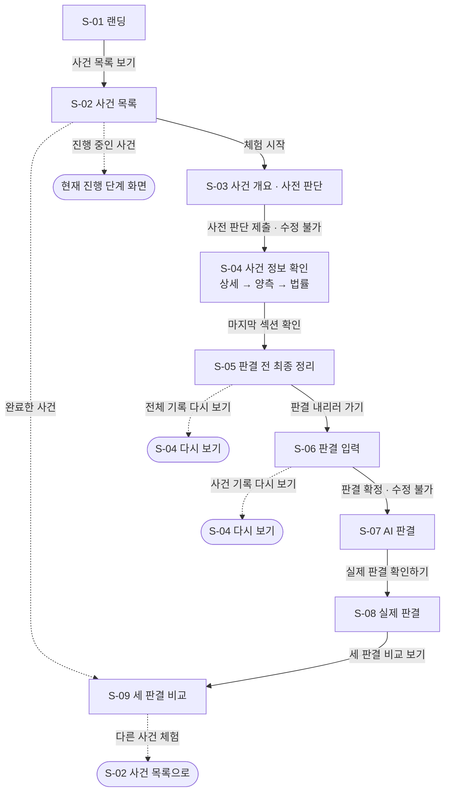
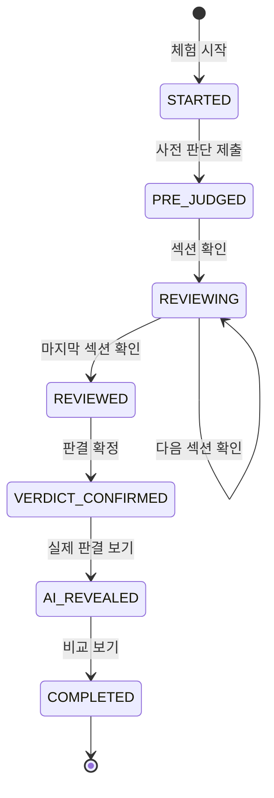

**작성 이력**

| 버전 | 날짜 | 내용 |
| --- | --- | --- |
| v0.1 | 2026-09-28 | 초안<br>• 사이트맵, 화면 목록(S-01 ~ S-14)<br>• 핵심 흐름, 화면 진입 조건<br>• 사전 판단 화면 위치 제안 |
| **v1.0** | **2026-09-28** | **결정 사항 확정**<br>① 사건 개요 · 사전 판단을 별도 화면(S-03)으로 분리<br>② S-04에는 사건 개요 정보만 남기고 사전 판단 결과는 표시하지 않음<br>③ 진행 상태는 서버에 저장해 새로고침 후에도 유지<br>④ 제출·확정한 판단은 어떤 경로로도 수정 불가. 체험 진행 상태(9장) 신설 |
| v1.1 | 2026-09-28 | 와이어프레임 v2 연결<br>• 화면 목록의 와이어프레임 열을 v2 페이지로 교체<br>• 진행 표시를 와이어프레임 v2의 6단계(사건 개요 · 사전 판단 / 상세 / 양측 / 법률 / 최종 정리 / 판결)로 수정<br>• 10장을 반영 결과로 갱신 |
| v1.2 | 2026-09-28 | 선고 가능 범위 · 재체험 결정 반영<br>① S-06 확정 차단 기준을 "법정형"에서 "선고할 수 있는 범위"(법정형 + 법률상 가능한 최대 감경·가중)로 변경, 경고 문구 "선고할 수 있는 범위를 벗어났습니다", S-04c · S-06 사이드바에 법정형과 선고 가능 범위를 함께 표시<br>② 결정 #8(재체험)을 "MVP는 사건당 1회 + 확장 대비 구조"로 확정(2장 결정 5), 완료한 사건 재진입 시 S-09로 이동<br>③ 9장 서버 규칙 문구 수정<br>④ 기준 문서 버전 갱신(요구사항 v5.2, ERD v1.0) |
| v1.3 | 2026-09-28 | 와이어프레임 v2.1 PDF 반영 확인<br>• 10장의 S-03 칩 · S-04c · S-06 항목을 반영 완료로 갱신 |
| v1.4 | 2026-09-28 | AI 비교 분석 실시간 생성 반영(요구사항 v5.3)<br>• S-08 진입 시 생성 시작<br>• S-09 공통점 · 차이점 영역의 준비 · 실패 처리 추가 |
| v1.5 | 2026-09-28 | 전체 문서 교차 검토 반영<br>• S-06 진행 표시 없음으로 정리(와이어프레임 기준)<br>• REQ-024 · 026 MVP 반영<br>• S-06 → S-04 이동 시 입력값 화면에서 기억<br>• 화면 목록 REQ를 기능명세 v3 단계에 맞춤(011 · 012 · 019 · 103 ~ 107)<br>• 재진입 처리를 API 1-6 표 기준으로 통일(9장에 "보낼 화면" 열)<br>• S-06 진입 조건을 REVIEWED로, 흐름도에 진행 중 사건 분기 추가<br>• 서버 규칙에 섹션 순서 강제 추가<br>• 와이어프레임 표기를 v2.1로 |
| v1.6 | 2026-09-29 | 문서 정합성 점검 결정 반영 (COMMON-4)<br>• 화면 진입 시 상태를 먼저 조회하지 않고 각 API의 `INVALID_STATE`로 이동(9장, API 6장 #1 확정)<br>• S-06 무죄 선택지 MVP 제외<br>• S-09 판결 카드 한 줄 요약(REQ-109 MVP, REQ-062 확장) · S-02 카드 이미지 · S-03 범죄 분류명 데이터 근거<br>• 쿠키 삭제 시 안내는 확장 기능(REQ-108), 화면 · 문구 미정(7 · 8장)<br>• 경합범 서비스 제외(2장 결정 6)<br>• 참조 문서 파일명 정리<br>• (낮음 항목) S-09 판단 이유 변화 3가지(무게가 바뀜 추가) · "익명 세션" → "익명 ID" 용어 통일 · S-14 단계 표기 MVP |
| v1.7 | 2026-09-29 | 와이어프레임 v2.2 반영<br>• 화면 목록(4장) · 진행 표시(2장)의 와이어프레임 표기를 v2.2로<br>• 10장에 v2.2 반영 결과 추가(예시 사건 교체, 무죄 선택지 삭제, S-02 정렬 · 더 보기 확장 표시, S-09 무게가 바뀜 카드 · 한 줄 요약, 권고 범위 막대 라벨, 사기 양형기준 유형 표기) |
| v1.8 | 2026-09-30 | 대표 사건(살인) 가공 결정 반영 (BE-13)<br>• S-06 형벌 종류에 사형 · 무기징역 추가(법정형에 있는 사건만, 요구사항 v5.6) |
| v1.9 | 2026-10-01 | 사형 · 무기징역 화면 규칙 반영 (COMMON-14, FE-10 구현 기준)<br>• S-06 감경 선택 방식, 그대로 선고할 때 숨기는 항목, 감경 시 선고 범위 막대 · 권고 범위 표시, 징역 상한 초과 안내 |
| v1.9 | 2026-09-30 | 예시 사건을 가상 살인 사건으로 교체 (COMMON-11)<br>• 10장 와이어프레임 반영 결과에서 예시 사건 항목을 미반영으로 정정 (ERD v1.5 · API v0.5) |
| v1.10 | 2026-10-02 | 사건 정보 섹션 표시 방식 팀 결정 반영 (BE-17)<br>• S-04 ③ 양측 주장: 검사 · 피고인·변호인 단 위에 안내 문구를 화면 고정 문구로 표시("판결문에 나온 사정을 ~ 측 입장에서 정리했어요", 출처를 양형 이유로 밝히지 않음). 서버 응답 · DB에는 두지 않는다<br>• S-04 섹션 본문은 줄바꿈을 그대로 표시(항목 하나가 한 줄)<br>• 화면 구현은 FE 이슈로 진행 (ERD v1.9 · API v0.11) |
| v1.11 | 2026-10-08 | MVP 완료 · 11 · 12차 회의 반영 (COMMON-20)<br>• 사이트맵 · 화면 목록에 확장 화면 추가: S-15 판결 성향 테스트 · S-16 성향 결과 · S-17 마이페이지(S-13 내 기록 흡수) · S-18 커뮤니티(이후) · S-19 관리자 검수. S-01은 판사의 책상 메인, S-02는 신문형 목록으로 개편(확장)<br>• AI 비교 분석(REQ-062 · 063) 제외 반영: S-08 생성 시작 · S-09 AI 분석 교체 · 내 판결 AI 요약 삭제<br>• 11장(확장 화면) 신설. 사용자 흐름은 `user-flow.md` |

---

## 1. 작성 원칙

- 화면 단위로 정리한다. 한 화면 안의 섹션(아코디언 단계 등)은 화면 안의 하위 구조로 표시한다.
- 기능 명세서의 구현 단계를 그대로 따른다: **MVP**(1~2주) / **확장**(3~6주) / **이후**.
- MVP 화면만으로 랜딩 → 비교까지 **로그인 없이** 끝까지 이동할 수 있어야 한다(REQ-003).
- 실제 판결은 S-08 전까지 어떤 화면에서도 노출하지 않는다(요구사항 2장).
- **한 번 제출한 판단은 되돌릴 수 없다.** 사전 판단과 최종 판결은 제출·확정 이후 어떤 화면, 뒤로 가기, 새로고침, 직접 URL 입력으로도 수정할 수 없다. 이 규칙은 화면이 아니라 **서버에서 강제**한다(9장).

---

## 2. 확정 사항

| # | 결정 | 내용 |
| --- | --- | --- |
| 1 | 사전 판단 화면 위치 | 사건 개요 + 사전 판단을 상세 사실관계 이전의 별도 화면(S-03)으로 분리한다 |
| 2 | S-04의 사전 판단 표시 | S-04 아코디언에는 사건 개요 정보만 남긴다. 사전 판단 결과는 S-04에 표시하지 않고, S-09 비교 화면에서 처음 다시 보여 준다 |
| 3 | 진행 상태 저장 | 체험 진행 상태를 서버(익명 ID 기준)에 저장한다. 새로고침·재접속 후에도 마지막 위치에서 이어진다 |
| 4 | 수정 불가 | 사전 판단 제출 후, 최종 판결 확정 후에는 절대 수정할 수 없다. 이미 지난 입력 화면에 다시 들어오면 현재 진행 단계의 화면으로 보낸다 |
| 5 | 재체험 (v1.2) | MVP는 같은 브라우저에서 사건당 1회만 체험한다. 이미 시작한 사건에 다시 들어오면 현재 진행 단계로, 완료한 사건은 S-09 결과 다시 보기로 보낸다. 다시 체험하기·로그인 연결은 이후 단계에서 붙일 수 있도록 데이터 구조만 준비한다(experience.attempt_no, anonymous_user.member_id) |
| 6 | 선고 가능 범위 (v1.2) | S-06에서 선고할 수 있는 범위를 벗어난 형량은 확정할 수 없다(버튼 비활성 + 서버 거절). 선고 가능 범위는 법정형에 법률상 가능한 최대 감경(작량감경 등)과 사실관계로 정해지는 가중(누범 등)을 반영한 가장 넓은 범위이며, 실제 사건에서 감경이 적용됐는지를 드러내지 않는다. MVP에서는 팀이 사건별로 직접 계산해 넣는다(요구사항 FR-3-3, penalty_rule). 경합범(동종 포함) 사건은 서비스 대상이 아니므로 경합범 가중은 반영하지 않는다(v1.6) |

**2번의 이유**: 사용자가 상세 정보를 보는 동안 자신의 사전 판단을 계속 보면, 최종 판결을 사전 판단에 맞추거나 일부러 다르게 내리려는 영향이 생길 수 있다. 두 판단을 각각 독립적으로 내리게 하려면 사전 판단은 비교 화면에서만 다시 보여 주는 편이 낫다.

**6번의 이유**: 실제 재판에서도 선고는 법정형(감경·가중 반영) 안에서만 가능하다. 다만 "법정형"만으로 막으면 감경이 적용된 실제 판결보다 좁아질 수 있고, 실제 감경 여부에 맞춘 범위를 보여 주면 판결 결과가 미리 드러난다. 그래서 법률상 가능한 가장 넓은 범위를 기준으로 한다.

### 진행 표시 (v1.1)

S-03 ~ S-05 상단의 "N / 6"과 S-03 · S-04 사이드바의 진행 상황은 6단계를 쓴다. 한 단계가 한 화면(또는 S-04의 한 섹션)에 대응한다. **S-06(판결 입력)에는 진행 표시가 없다** — 상단은 `사건 기록 다시 보기`만, 사이드바는 참고 정보(법정형 · 선고할 수 있는 범위 · 권고 범위 · 사건 기록 바로가기)다. 6단계 "판결"은 S-03 · S-04 사이드바의 마지막 항목으로만 보인다(v1.5, 와이어프레임 v2.2 기준).

| 단계 | 화면 | 사이드바 표시 |
| --- | --- | --- |
| 1 / 6 | S-03 | 사건 개요 · 사전 판단 |
| 2 / 6 | S-04<br>② | 상세 사실관계 |
| 3 / 6 | S-04<br>③ | 양측 주장 |
| 4 / 6 | S-04<br>④ | 법률 · 양형기준 |
| 5 / 6 | S-05 | 판결 전 최종 정리 |
| (6) | S-06 | 판결 (S-06 화면에는 표시 없음) |

S-04 이후 "사건 개요 · 사전 판단"은 ✓ 완료 표시만 하고 사전 판단 결과는 보여 주지 않는다.

---

## 3. 사이트맵

```
내Law남불
├── S-01 랜딩 / 홈 ···················· [MVP]
│   └── (섹션) 서비스 소개 · 체험 방식 ···· [MVP] 랜딩 안 앵커 (제안)
├── S-02 사건 목록 ····················· [MVP]
└── 사건 체험 (사건별)
    ├── S-03 사건 개요 · 사전 판단 ········ [MVP]
    ├── S-04 사건 정보 확인 (아코디언) ···· [MVP]
    │   ├──<br>① 사건 개요 (다시 보기용, 접힘)
    │   ├──<br>② 상세 사실관계
    │   ├──<br>③ 양측 주장
    │   └──<br>④ 법률 · 양형기준
    ├── S-05 판결 전 최종 정리 ············ [MVP]
    ├── S-06 판결 입력 ···················· [MVP]
    └── 판결 공개 (결과)
        ├── S-07 AI 판결 ·················· [MVP]
        ├── S-08 실제 판결 ················ [MVP]
        └── S-09 세 판결 비교 ············· [MVP]

공통
├── 푸터 법적 고지 ······················ [MVP] (모든 화면)
├── S-10 이용약관 ······················· [확장]
├── S-11 개인정보처리방침 ··············· [확장]
├── S-12 로그인 / 회원가입 ·············· [이후] (v1.11: 카카오 로그인 검토)
├── S-13 내 기록 (판결 기록 목록) ······· [이후] → v1.11: S-17 마이페이지로 흡수
└── S-14 404 · 오류 ····················· [MVP]

확장 (v1.11, 11 · 12차 회의)
├── S-01 → 판사의 책상 메인 ·············· [확장] 서류철 · 신문 · 핸드폰 · 컴퓨터
├── S-02 → 신문형 사건 목록 ·············· [확장]
├── 판결 성향 테스트
│   ├── S-15 테스트 시작 · 문항 ·········· [확장]
│   └── S-16 성향 결과 (내 결과 · 공유) ·· [확장]
├── S-17 마이페이지 ······················ [확장]
├── S-18 커뮤니티 ························ [이후 · 검토]
└── S-19 관리자 사건 · AI 판결 검수 ······ [확장, 관리자 전용]
```

---

## 4. 화면 목록

| ID | 화면 | 경로 (제안) | 와이어프레임 v2.2 | 단계 | 주요 기능 (REQ) | 비고 |
| --- | --- | --- | --- | --- | --- | --- |
| S-01 | 랜딩 / 홈 | / | p.2 | MVP | 001, 002, 071 (124 확장) | 확장에서 판사의 책상 메인으로 개편(v1.11) |
| S-02 | 사건 목록 | /cases | p.3 | MVP | 005, 006, 007, 011, 012 (010 확장) | 유형 칩만. 진행 상태 배지는 확장. 진행 중 · 완료한 사건은 체험 시작으로 현재 단계 · S-09로 이동. 확장에서 신문형 목록(REQ-125) · 재판장 전환(REQ-126) |
| S-03 | 사건 개요 · 사전 판단 | /cases/{caseId}/start | p.4 | MVP | 015, 092, 016, 017, 103 (093 확장) | 제출 후 수정 불가 |
| S-04 | 사건 정보 확인 | /cases/{caseId}/review | p.5 ~ 7 (S-04a ~ c) | MVP | 018, 019, 020, 021, 022, 023, 024, 034, 035, 105 | 아코디언 4섹션. 사전 판단 결과 미표시. 순서는 서버가 강제 |
| S-05 | 판결 전 최종 정리 | /cases/{caseId}/summary | p.8 | MVP | 025, 026 | 상단 ← 이전 단계 · "5 / 6" |
| S-06 | 판결 입력 | /cases/{caseId}/verdict | p.9 ~ 12 (S-06a ~ d) | MVP | 029, 030, 031, 032, 034, 035, 037, 038, 103, 104 (033 · 036 확장) | 확정 후 수정 불가. 선고 가능 범위 밖은 확정 불가 |
| S-07 | AI 판결 | /cases/{caseId}/result/ai | p.13 | MVP | 046, 048, 050 (049 · 128 확장) | 공개 진행 "2 / 3" |
| S-08 | 실제 판결 | /cases/{caseId}/result/court | p.14 | MVP | 051, 052, 053 (055 확장) | 공개 진행 "3 / 3" |
| S-09 | 세 판결 비교 | /cases/{caseId}/result/compare | p.15 | MVP | 057, 058, 060, 061, 012, 109 (059 · 064 · 096 · 097 · 118 확장) | 최상단에 처음 판단 → 직접 판결. 완료한 사건 재진입 시 도착 화면. 판결 카드 한 줄 요약은 REQ-109(MVP, 확장에서도 유지). v1.11: REQ-062 · 063 제외, 106 · 107은 유지 여부 미정 |
| 모바일 | S-02 · S-03 · S-04a · S-06a · S-09 | — | p.16 | MVP (반응형 기본) | 004 (확장) | 390px |
| S-10 | 이용약관 | /terms | 없음 | 확장 | 072 | 푸터 링크 |
| S-11 | 개인정보처리방침 | /privacy | 없음 | 확장 | 073 | 푸터 링크 |
| S-12 | 로그인 / 회원가입 | /login, /signup | 없음 | 이후 | 066, 067 |  |
| S-13 | 내 기록 | /me/records | 없음 | 이후 | 068, 069, 070 | v1.11: S-17 마이페이지의 "체험한 사건" 영역으로 흡수 |
| S-14 | 404 · 오류 | — | 없음 | MVP | — | 잘못된 사건 ID 등 |
| S-15 | 판결 성향 테스트 | /test | 없음 | 확장 | 112, 117 | v1.11. 시작 화면 + 문항(12 ~ 16개). 결과 전까지 이전 문항 수정 가능 |
| S-16 | 성향 결과 | /test/result, /test/types/{code} | 없음 | 확장 | 113, 114, 115, 116 | v1.11. 내 결과 · 공유된 결과(유형 설명만) |
| S-17 | 마이페이지 | /me | 없음 | 확장 | 127, 119 (130 이후) | v1.11. 성향 없으면 S-15로 안내. S-13 흡수 |
| S-18 | 커뮤니티 | /community | 없음 | 이후 | 131 | v1.11. 검토 중 |
| S-19 | 관리자 검수 · 사건 등록 | /admin | 없음 | 확장 | 047, 075, 078, 133 | v1.11. 관리자 전용 (BE-33 · FE-16) |

> 경로는 화면 구분을 위한 제안이다. 실제 라우팅 방식은 기술 스택 확정 후 정한다. (v1.11) MVP 경로는 `frontend/src/app/routes.js`에 구현된 값과 같다. S-15 ~ S-19 경로는 제안이다.
>

---

## 5. 핵심 흐름



| 구간 | 다시 볼 수 있는 것 | 절대 수정할 수 없는 것 |
| --- | --- | --- |
| S-03 제출 이후 | 사건 개요 (S-04 섹션<br>①) | 사전 판단 |
| S-04 확인 중 (PRE_JUDGED · REVIEWING) | 확인한 섹션 (S-04) | 사전 판단 |
| 사건 정보 확인 완료 (REVIEWED) | S-04 · S-05 · S-06 사이 이동 | 사전 판단 |
| S-06 확정 이후 | 공개된 결과 화면끼리 이동 (S-07 ↔ S-08 ↔ S-09) | 사전 판단, 최종 판결 |
| 비교 완료 이후 (v1.2) | S-07 · S-08 · S-09 결과 다시 보기 | 사전 판단, 최종 판결. 같은 사건을 새로 체험할 수 없음(MVP) |

**지난 입력 화면에 다시 들어온 경우** (뒤로 가기, 새로고침, URL 직접 입력 모두 해당)

| 들어온 화면 | 현재 진행 상태 | 처리 |
| --- | --- | --- |
| S-02 체험 시작 | 진행 중인 체험 있음 | 현재 진행 단계의 화면으로 이동 |
| S-02 체험 시작 | 비교까지 완료 (v1.2) | S-09로 이동 (결과 다시 보기) |
| S-03 | 사전 판단 제출 완료 | 현재 상태의 화면으로 이동 (9장 "보낼 화면") |
| S-06 | 판결 확정 완료 | 공개가 진행된 가장 마지막 결과 화면(S-07 · S-08 · S-09)으로 이동 |
| S-07 ~ S-09 | 판결 확정 전 | 현재 진행 단계의 화면으로 이동 |
| S-08 | AI 판결 미확인 | S-07로 이동 (AI → 실제 순서 유지, REQ-050) |
| 그 밖 | 허용되지 않은 화면 | 9장 "보낼 화면"으로 이동 (예: REVIEWED 전 S-05 · S-06 → S-04, 확정 후 S-04 ~ S-06 → 결과 화면, AI_REVEALED에서 S-09 → S-08) |

---

## 6. 화면별 구성과 진입 조건

### S-01 랜딩 / 홈 — MVP (p.2)

- 헤더: 로고 · 사건 목록 · 서비스 소개(랜딩 섹션 앵커)
- 히어로: 헤드라인, 서브 카피, `사건 목록 보기` / `체험 방식 알아보기`
- 특징 카드 3개: 먼저 판단하기 · 직접 판결하기 · 세 판결 비교
- 푸터: 법적 고지 (REQ-071)
- **진입 조건**: 없음

### S-02 사건 목록 — MVP (p.3)

- 제목 + 건수 요약, 범죄 유형 칩, (정렬은 이후 단계)
- 사건 카드: 사건 이미지(없으면 범죄 유형별 기본 이미지) / 유형 · 난이도 · 예상 시간 배지 / 제목 / 짧은 소개 / 중립 키워드 / 참여자 수 / `체험 시작`
- **진입 조건**: 없음
- **이동**: `체험 시작` → 해당 사건의 현재 진행 단계 화면. 처음이면 S-03, 완료한 사건이면 S-09. 익명 ID이 없으면 이 시점에 발급(REQ-098)

### S-03 사건 개요 · 사전 판단 — MVP (p.4)

- 상단 바: `← 목록` · 사건 제목 · 유형 배지 · "1 / 6"
- 사건 개요: 죄명 · 범죄 분류명(예: "사기 / 재산범죄", API `crimeCategoryLabel`) · 뉴스 기사 수준의 중립적 개요 (REQ-015, 094)
- 안내 문구: "지금은 뉴스에서 볼 수 있는 정도의 정보만 있어요. 기사로 이 사건을 접했다고 생각하고 판단해 보세요." (REQ-092)
- 형량 구간 선택: 객관식 1개 (REQ-016)
- (확장) 작용 요소 선택: 개요 단계 요소 중 1~2개 (REQ-093)
- "제출하면 이 판단은 바꿀 수 없어요." + `판단 제출하고 사건 자세히 보기` → S-04
- **진입 조건**: 사건 ID 유효, 사전 판단 미제출
- **재진입**: 이미 제출했다면 현재 상태의 화면으로 이동 (9장 "보낼 화면")

### S-04 사건 정보 확인 — MVP (p.5 ~ 7)

- 상단 바: `← 목록` · 사건 제목 · 진행 막대 + "N / 6"
- 아코디언 섹션
  1. 사건 개요 — S-03에서 본 개요. 접힌 상태, 다시 펼쳐 볼 수 있음
  2. 상세 사실관계 — 주요 사실관계, 피해 결과 카드 4칸(REQ-021), 피고인 관련 사실, 합의·피해 회복
  3. 양측 주장 — 검사 / 피고인·변호인 2단. 각 단 위에 안내 문구를 고정으로 보여 준다(v1.10, 서버 응답에 없음). 출처를 "양형 이유"라고 밝히지 않는다 — 재판부가 실제로 인정한 사정인지가 판결 공개 전에 드러나기 때문이다
     - 검사(`PROSECUTOR`): "판결문에 나온 사정을 검사 측 입장에서 정리했어요."
     - 피고인·변호인(`DEFENSE`): "판결문에 나온 사정을 피고인 · 변호인 측 입장에서 정리했어요."
  4. 법률 · 양형기준 — 적용 법률, **법정형과 선고할 수 있는 범위**(v1.2), 권고 범위, 산출 근거, 용어 설명
- **사전 판단 결과는 표시하지 않는다** (2장 결정 2)
- 섹션 본문(`content`)은 줄바꿈을 그대로 보여 준다. 항목 하나가 한 줄이다(v1.10, ERD v1.9)
- 각 섹션 하단: `읽었습니다 · 다음 단계 열기`. 다음 섹션은 "잠김 · 이전 단계 확인 후 열립니다"
- 사이드바: 진행 상황 6단계 (2장 진행 표시)
- 마지막 섹션 확인 후 `판결 전 최종 정리로` → S-05
- **진입 조건**: 사전 판단 제출 완료
- **진행 저장**: 섹션을 확인(`읽었습니다`)할 때마다 서버에 기록(API 7). 새로고침하면 확인한 섹션과 그다음 섹션(`lastReviewedStep + 1`)까지 펼친 상태로 복원. 잠긴 섹션 본문은 서버가 내려주지 않는다

### S-05 판결 전 최종 정리 — MVP (p.8)

- 좌측: 사건 개요, 핵심 사실 요약, 양측 주장 2단 카드
- 우측: 적용 법률·법정형·선고할 수 있는 범위, 권고 범위 막대 + 산출 근거
- `전체 기록 다시 보기` → S-04 / `판결 내리러 가기` → S-06
- **진입 조건**: S-04의 모든 섹션 확인 완료

### S-06 판결 입력 — MVP (p.9 ~ 12)

-
  1. 형벌 종류 (사건별 허용 형벌만: 사형 · 무기징역 · 징역 · 벌금 중 법정형에 있는 것. 무죄는 MVP 제외, v1.6. 사형 · 무기는 v1.8 — 그대로 선고하거나 작량감경해 선고. `reducedTo` 선택지는 사형 → 무기징역 · 징역, 무기징역 → 징역이며, 형벌을 고르면 그 조합만 감경 선택지로 나타난다. 징역으로 감경하면 징역 상한 50년)
-
  1. 형량 + 권고 범위 대비 위치 막대 + 참고/경고 박스 + 집행유예
  - 권고 범위 안: 참고 박스 (S-06a)
  - 권고 범위 밖(선고 가능 범위 안): 경고 박스 (확장, S-06b, REQ-036)
  - **선고 가능 범위 밖**: 경고 박스 **"선고할 수 있는 범위를 벗어났습니다."** + 확정 버튼 비활성 (MVP, S-06c, REQ-037) — v1.2에서 기준을 법정형 → 선고 가능 범위로 변경
  - **사형 · 무기징역 (v1.9, FE-10)**
    - 감경 선택: 감경할 수 있는 형벌(사형 · 무기징역)을 고르면 `감경해서 선고하기` 체크박스가 나타난다. 감경 선택지가 하나면(무기징역 → 징역) 자동으로 고르고 "징역으로 감경해요"라고 안내하고, 둘이면(사형 → 무기징역 · 징역) 라디오로 고른다
    - 그대로 선고: 형량 입력 · 권고 범위 막대 · 집행유예를 숨기고 "형량 입력 없이 ○○으로 선고해요"라고 안내한다. 양형기준 권고 범위는 유기징역 기준이라 적용되지 않는다고 함께 안내한다
    - 감경해서 징역 선고: 선고 가능 범위는 처음 고른 형벌의 행을 쓴다(무기 → 징역 10년 ~ 50년, 사형 → 징역 20년 ~ 50년). 막대는 그 상한(50년)까지 그리고, 하한 미만 구간은 빗금으로 표시하며, 권고 범위 음영은 선고 가능 범위 안쪽만 칠한다
    - 징역 상한 초과 안내: `징역`을 고른 채 징역 상한을 넘기면 범위 경고와 함께 "무기징역(또는 사형)을 고른 뒤 감경해서 선고할 수 있어요"를 덧붙인다(그 형벌의 감경 범위 안일 때만)
    - 집행유예: 사형 · 무기징역은 감경해도 징역 10년 이상이라 집행유예를 붙일 수 없다고 안내한다(형법 제62조 · 제55조)
-
  1. 판단 요소 선택 + ↑/↓ (사건별 공통 목록 전체)
- (확장) 추가 판단 이유 (REQ-033)
- 사이드바: **법정형 · 선고할 수 있는 범위**(v1.2), 권고 범위, 산출 근거, 사건 기록 바로가기 → S-04
- `판결 확정하기` → 화면 안 확인 박스(S-06d) → S-07
- **진입 조건**: `REVIEWED`(S-04 모든 섹션 확인 완료), 판결 미확정
- **재진입**: 이미 확정했다면 공개가 진행된 가장 마지막 결과 화면으로 이동
- **사건 기록 보러 갔다 올 때**: `사건 기록 다시 보기` · 사건 기록 바로가기로 S-04에 갔다 돌아오면 입력값을 **화면(브라우저 메모리)이 기억해 복원**한다(v1.5 결정). 서버에는 저장하지 않는다
- **입력 중 새로고침**: MVP에서는 입력값이 유지되지 않는다(임시 저장 REQ-039는 이후 단계). 새로고침하면 S-06 빈 폼으로 다시 열린다. S-02에서 다시 들어오면 S-05로 이동한다(9장 "보낼 화면")

### S-07 AI 판결 — MVP (p.13)

- 공개 진행 탭: 내 판결(공개) · **AI 판결(공개 중)** · 실제 판결(비공개)
- AI 형벌·형량·집행유예, 내 판결과의 차이, 참고 자료 태그, 주요 판단 근거, 가중·감경 요소
- (확장) 유사 판례·양형인자 판단 과정 펼치기
- `실제 판결 확인하기` → S-08
- **진입 조건**: 판결 확정 완료

### S-08 실제 판결 — MVP (p.14)

- 강조 배너: 실제 형량 + 집행유예·부가 처분, 내 판결·AI 판결 형량
- 재판부 판단 근거 요약, 판결문 발췌 + 쉽게 말하면 (REQ-053), 가중·감경 요소
- (확장) 이 사건에 대하여 사이드바 (비식별화 항목, 출처 기관)
- ~~(확장) 이 화면에 들어올 때 서버가 AI 비교 분석 생성을 시작한다~~ — v1.11: AI 비교 분석(REQ-063) 제외로 삭제
- `세 판결 비교 보기` → S-09
- **진입 조건**: S-07 확인 완료

### S-09 세 판결 비교 — MVP (p.15)

- **최상단: 처음 판단 → 직접 판결** (REQ-057). 사전 판단을 다시 보여 주는 첫 화면
  - (확장) 새로 알게 된 요소 / 처음부터 알던 요소 / 이미 알던 요소의 무게가 바뀜 (REQ-096, 변화 2유형 + 변화 없음 1유형)
- 3열 판결 카드: 내 판결 · AI 판결 · 실제 판결
  - 카드마다 한 줄 요약 (REQ-109): AI · 실제 판결은 팀이 등록한 문장, 내 판결은 고른 판단 요소의 요약 태그로 만든 규칙 문장
  - ~~(확장) 내 판결 요약은 AI 실시간 요약으로 교체 (REQ-062)~~ — v1.11 제외, 규칙 문장 유지
- (확장) 형량 한눈에 보기 막대 (REQ-059)
- 판단 요소 비교 매트릭스 + 방향 + 분류 태그 (REQ-060, 061)
- 공통점 · 차이점: MVP는 매트릭스 기반 규칙 문장, 확장에서 AI 분석 (REQ-063)
  - ~~(확장) AI 분석은 체험별 실시간 생성 (REQ-107, `sequence-diagram.md` 8장)~~ — v1.11: REQ-063 제외로 확장에서도 규칙 문장을 쓴다
- (확장) 체험 후 안내 문구 (REQ-097), 판결 이유 전문 펼치기 (REQ-064)
- (확장) 비교 뒤 성향 갱신(REQ-118): 성향 테스트를 했으면 "이번 체험으로 달라진 내 성향" → S-17, 안 했으면 성향 테스트 권유 → S-15 (`user-flow.md` 3-3)
- `다른 사건 체험` → S-02
- **진입 조건**: S-08 확인 완료
- **완료한 사건 재진입**: S-02에서 같은 사건을 누르면 이 화면으로 온다(2장 결정 5). MVP에서는 "다시 체험하기" 버튼을 두지 않는다

---

## 7. 전역 요소

| 요소 | 위치 | 단계 | 비고 |
| --- | --- | --- | --- |
| 헤더 | 모든 화면 (S-03 ~ S-09는 사건 전용 상단 바로 대체) | MVP | 로고, 사건 목록, 서비스 소개 |
| 헤더 `내 기록` · `로그인` | 헤더 우측 | 이후 | MVP에서는 없음. v1.11: `마이페이지`(S-17)는 확장, `로그인`(카카오)은 이후 · 검토 |
| 푸터 법적 고지 | 모든 화면 | MVP | REQ-071 |
| 푸터 이용약관 · 개인정보처리방침 링크 | 모든 화면 | 확장 | REQ-072, 073 |
| 익명 ID | 사건 체험 시작 시 발급 | MVP | REQ-098 |
| 쿠키 삭제 시 진행 기록 안내 | 미정 | 확장 | REQ-108. 표시 화면 · 문구는 미정 |

---

## 8. 남은 결정 사항

| # | 내용 | 제안 | 영향 |
| --- | --- | --- | --- |
| 5 | 서비스 소개 메뉴를 별도 페이지로 둘지 | MVP는 랜딩 섹션 앵커 | 화면 수 |
| 7 | 익명 ID 유지 방식과 기간 (쿠키 등) | API 명세 6장 #2 제안: 쿠키 `NLNB_AID`, 1년, 같은 도메인 | 쿠키 삭제 시 안내는 확장 기능 REQ-108로 확정(v1.6). 어느 화면에 어떤 문구로 둘지는 미정 |

> v1.0의 #6(판결 확정 전 확인 단계 형태)은 와이어프레임 v2 S-06d에서 **화면 안 확인 박스**로 확정되어 삭제했다.
v1.1의 #8(같은 사건 재체험)은 v1.2에서 **2장 결정 5**로 확정되어 삭제했다.
>

---

## 9. 체험 진행 상태 (ERD·API 설계용)

결정 3(서버 저장)과 결정 4(수정 불가)를 지키려면, 사건별 체험 진행을 **익명 ID × 사건** 단위의 상태로 서버에서 관리해야 한다. (`erd.md`의 `experience` 테이블. 재체험 대비로 `attempt_no`를 두며 MVP에서는 항상 1)

### 상태 목록

| 상태 | 의미 | 도달 조건 | 허용 화면 | 보낼 화면 |
| --- | --- | --- | --- | --- |
| `STARTED` | 체험 시작 | S-02에서 `체험 시작` | S-03 | S-03 |
| `PRE_JUDGED` | 사전 판단 제출 | 사전 판단 제출 | S-04 | S-04 |
| `REVIEWING` | 사건 정보 확인 중 | S-04 섹션 확인 (마지막 확인 섹션 번호 함께 저장) | S-04 | S-04 |
| `REVIEWED` | 사건 정보 확인 완료 | S-04 마지막 섹션 확인 | S-04, S-05, S-06 | S-05 |
| `VERDICT_CONFIRMED` | 판결 확정 | S-06 확정 | S-07 | S-07 |
| `AI_REVEALED` | AI 판결 확인 | S-07 → `실제 판결 확인하기` | S-07, S-08 | S-08 |
| `COMPLETED` | 비교까지 완료 | S-08 → `세 판결 비교 보기` | S-07, S-08, S-09 | S-09 |

"보낼 화면"은 API 명세 1-6 표와 같다. 허용되지 않은 화면에 들어오거나 `INVALID_STATE`를 받으면 이 화면으로 보낸다.



### 서버가 지켜야 할 규칙

- **상태는 앞으로만 이동한다.** 이전 상태로 되돌리는 API는 두지 않는다.
- **사전 판단은 한 번만 저장된다.** `STARTED`가 아닌 상태에서 사전 판단 제출이 오면 거절한다.
- **최종 판결은 한 번만 저장된다.** `REVIEWED`가 아닌 상태에서 판결 제출이 오면 거절한다.
- **선고 가능 범위를 벗어난 판결은 저장하지 않는다.** S-06c에서 확정 버튼이 비활성이지만, 서버에서도 `penalty_rule`의 선고 가능 범위(`allowed_min` ~ `allowed_max`)로 검증한다.
- **결과는 상태에 맞는 것만 내려준다.** `VERDICT_CONFIRMED` 전에는 AI 판결을, `AI_REVEALED` 전에는 실제 판결을, `COMPLETED` 전에는 비교 결과(사전 판단 포함)를 응답하지 않는다.
- **같은 사건의 체험은 익명 사용자당 하나만 만든다(MVP).** 이미 체험이 있으면 새로 만들지 않고 기존 체험의 현재 상태를 돌려준다.
- **섹션 확인 순서는 서버가 강제한다(MVP, REQ-019).** 다음 섹션(`last_reviewed_step + 1`)만 확인할 수 있고, 잠긴 섹션 본문은 응답하지 않는다.
- 화면은 허용되지 않은 화면에 들어오면 위 표의 "보낼 화면"으로 이동한다. **진입 시 상태를 먼저 조회하지 않고, 각 화면 API가 돌려주는 `INVALID_STATE`의 `currentStatus`로 이동한다**(v1.6, API 명세 1-6 · 6장 #1 확정).

---

## 10. 와이어프레임 v2 · v2.1 · v2.2 반영 결과

| 와이어프레임 작업 (IA v1.0 기준) | IA 화면 | 반영 |
| --- | --- | --- |
| 사전 판단 신규 | S-03 | ✅ p.4 (v2.1에서 작용 요소 칩 2개로 수정) |
| 사건 개요 · 양측 주장 · 법률 펼친 상태 | S-04 섹션<br>①,<br>③,<br>④ | ✅<br>② ·<br>③ ·<br>④ 펼침(p.5 ~ 7, v2.1에서 S-04c에 선고할 수 있는 범위 표기).<br>① 펼친 상태는 그리지 않음(접힘만) |
| 진행 상황 6단계 | S-03 ~ S-05 (S-06은 표시 없음) | ✅ 와이어프레임 기준으로 IA 수정 (2장, v1.5) |
| 법정형 이탈 경고 | S-06 | ✅ p.11 (v2.1에서 "선고할 수 있는 범위를 벗어났습니다." + 사이드바 표기, 확정 버튼 비활성) |
| 확정 확인 영역 | S-06 | ✅ p.12 |
| 처음 판단 → 직접 판결 | S-09 최상단 | ✅ p.15 |
| 모바일 재정렬 | S-02, S-03, S-04, S-06, S-09 | ✅ p.16 |

**v2.2 반영 결과** (문서 정합성 점검 보고서의 "와이어프레임 미반영 목록")

| 와이어프레임 작업 | IA 화면 | v2.2 반영 |
| --- | --- | --- |
| 예시 사건 교체 (C-04) | 전체 | ❌ p.3 ~ 16. v1.9에서 문서 예시가 가상 살인 사건으로 바뀌어 와이어프레임(사기)과 전면으로 다름 (정합성 보고서 미반영 목록) |
| 사기 양형기준 산출 근거 "제1유형(1억 원 미만), 기본영역", 권고 범위 6개월 ~ 1년 6개월 (C-05) | S-04 ④ · S-05 · S-06 | ✅ p.7 · 8 · 9 ~ 12 |
| 형벌 종류에서 무죄 삭제 (C-12) | S-06 | ✅ p.9 ~ 12 · 16 (징역 · 벌금만) |
| 정렬 드롭다운 · 사건 더 보기에 확장 표시 (C-13) | S-02 | ✅ p.3 |
| 판결 카드 한 줄 요약 유지 (C-14, REQ-109) | S-09 | ✅ p.15 |
| "이미 알던 요소의 무게가 바뀜" 카드 추가 (C-16) | S-09 | ✅ p.15 (확장 카드 3개) |
| 권고 범위 막대 오른쪽 라벨 "선고할 수 있는 상한" (C-27) | S-04 ④ · S-05 · S-09 | ✅ p.7 · 8 · 15 |
| 쿠키 삭제 시 안내 (C-15, REQ-108) | 미정 | — 표시 화면 · 문구 미정이라 대상 아님 |

---

## 11. 확장 화면 (v1.11, 11 · 12차 회의)

확장 단계에서 추가 · 개편하는 화면의 구성 초안이다. 화면 사이 이동과 분기는 `user-flow.md` 3장을 따르고, 요구사항은 요구사항 명세 18장, 기능은 기능 명세 REQ-112 ~ 134를 따른다. 디자인 시안은 아직 없다.

### S-01 판사의 책상 메인 — 확장 (REQ-124)

- 공간 메타포(Room Metaphor): 책상 위 물건이 각 서비스로 가는 입구다
  - 서류철 → S-15 판결 성향 테스트
  - 신문 → S-02 신문형 사건 목록
  - 핸드폰 → S-17 마이페이지
  - 컴퓨터 → S-18 커뮤니티 (이후. 그 전에는 "준비 중" 표시)
- (이후) 오늘 · 이번 주의 사건 (REQ-132)
- 푸터 법적 고지 유지 (REQ-071)
- **진입 조건**: 없음

### S-02 신문형 사건 목록 — 확장 (REQ-125 · 126 · 010)

- 지면 신문 디자인, 사건 유형별 지면 배치. 사건 카드 정보(REQ-006)는 기사 형태로 유지
- 내 진행 상태 배지(미체험 · 진행 중 · 완료, REQ-010)
- 사건을 누르면 재판장으로 빨려 들어가는 전환 → 체험 상태에 맞는 화면(MVP 규칙 그대로)
- 실제 판결은 노출하지 않는다

### S-15 판결 성향 테스트 — 확장 (REQ-112 · 117)

- 시작 화면: 소요 시간, 정답이 없다는 안내, `시작하기`
- 문항 화면: 진행 표시 "n / N", 일상 시나리오 1개 + 선택지, `이전 문항`
- 마지막 문항 뒤 결과 저장(익명 ID) → S-16
- **진입 조건**: 없음. 이미 결과가 있어도 다시 할 수 있다(재응시 처리는 미정)

### S-16 성향 결과 — 확장 (REQ-113 ~ 116)

- 유형(4글자 코드 · 유형명 · 캐릭터), 한 줄 성향, 축별 성향, 관용 지수 게이지
- 안내: 정답 아님 · 관용 지수가 높을수록 좋은 것 아님 · 일상 가치관 기준이라 법적 판단과 다름 · 실제 MBTI와 다를 수 있음 ("MBTI" 표기 금지)
- 버튼: **`실제 사건으로 판결하러 가기`**(주 버튼) → S-02, `공유하기`, `다시 하기` → S-15, `마이페이지` → S-17
- 공유된 결과(`/test/types/{code}`): 유형 설명만 보여 주고 `나도 해 보기` → S-15
- **진입 조건**: 내 결과는 테스트 완료 후. 공유된 결과는 없음

### S-17 마이페이지 — 확장 (REQ-127 · 119)

- 성향 결과 있음: 캐릭터 · 유형 · 관용 지수, 종합 판결 성향 4축 그래프(축마다 양쪽 성향의 비중), 체험별 성향 변화 흐름
- 성향 결과 없음: 빈 상태 + `성향 테스트 하러 가기` → S-15
- 체험한 사건: 완료 → S-09, 진행 중 → 현재 단계 화면 (S-13 내 기록 흡수)
- (이후) 프로필 레벨(REQ-130), 카카오 로그인으로 기록 옮기기(REQ-066 · 067)
- **진입 조건**: 없음 (익명 ID 기준)

### S-18 커뮤니티 — 이후 · 검토 (REQ-131)

- 성향 캐릭터 · 레벨 프로필로 사건 의견 공유. 로그인 · 운영 정책이 정해진 뒤 설계한다

### S-19 관리자 검수 · 사건 등록 — 확장 (REQ-133, BE-33 · FE-16)

- 자동 적재된 사건(DRAFT) · AI 판결 후보(PENDING) 목록 → 상세 확인 → 승인 · 반려 · 공개
- 파이프라인이 남긴 요약어 후보 · 참고 자료(`input_snapshot`) · 회차 선택 근거 · 사전 학습 점검 판정 표시
- **진입 조건**: 관리자 인증 (방식 미정)
