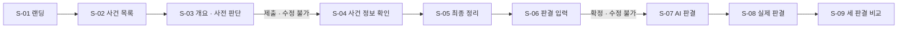

# MVP 정의서

## 작성 이력

| 버전 | 날짜 | 내용 |
| --- | --- | --- |
| v1 | 2026-09-29 | `docs/` 설계 문서(COMMON-4 반영본) 교차 검토 후 MVP 범위 · 흐름 · 완료 기준 · 선행 결정 사항 정리 (COMMON-5) |
| v1.1 | 2026-09-30 | 대표 사건(살인) 가공 결정 반영 (BE-13): REQ-029 형벌 종류에 사형 · 무기징역 추가, 근거 문서 버전 갱신, 살인 사전 판단 구간 8개(벌금형 제외) 반영 |
| v1.2 | 2026-09-30 | 예시 사건을 가상 살인 사건으로 교체 (COMMON-11): 근거 문서 버전 갱신, 11장 차단 이슈에서 대표 판례 · 데이터 확보 경로를 해결로 표시하고 실제 사건 데이터 주입 방법을 신규 항목으로 추가 |
| v1.3 | 2026-09-30 | BE-16 시드 반영: 근거 문서 버전 갱신(ERD v1.6 · API v0.6 · 기술 스택 v1.3) |
| v1.4 | 2026-10-02 | BE-17 반영: 11장 차단 이슈 🔴2(실제 사건 데이터 주입 방법)를 해결로 표시 |
| v1.5 | 2026-10-06 | 기획 단계 리뷰 준비 회의 결정 반영 (COMMON-16): 11장 차단 이슈 🟠4(규칙 문장 틀 · 내 판결 한 줄 요약 틀)를 해결로 표시 |

## 근거 문서

이 문서는 아래 문서를 요약 · 재구성한 것이다. 새 결정을 만들지 않으며, 내용이 다르면 **원 문서가 우선**한다.

| 문서 | 버전 | 이 문서에서 가져온 것 |
| --- | --- | --- |
| `final-planning.md` | v4.4 | MVP 목표, 포지셔닝, 기능 우선순위(MoSCoW) |
| `requirements-specification.md` | v5.6 | MVP 검증 목표, 데이터 구조 요구사항(DR), 미결정 사항(15장) |
| `functional-specification.md` | v3.3 | 기능별 구현 단계(MVP 48 · 확장 26 · 이후 24 · 데이터 13) |
| `information-architecture.md` | v1.9 | 화면 목록(S-01 ~ S-14), 체험 진행 상태, 진입 조건 |
| `api-specification.md` | v0.6 | MVP API 14개 |
| `erd.md` | v1.6 | 테이블 구성, 선고 가능 범위 결정 |
| `sequence-diagram.md` | v0.5 | 체험 흐름별 처리 순서 |
| `tech-stack.md` | v1.3 | MVP 기술 구성 |
| `document-consistency-report.md` | — | 와이어프레임 미반영 목록 |

---

## 1. MVP 한 줄 정의

> 로그인 없이, **대표 사건 1건**으로 **사전 판단 → 단계별 사건 확인 → 직접 판결 → AI 판결 → 실제 판결 → 세 판결 비교**까지 끝까지 동작하는 체험.

## 2. MVP로 검증하려는 것

MVP의 목적은 완성된 AI · RAG 시스템이 아니라 **핵심 경험이 실제로 의미 있게 동작하는지** 확인하는 것이다(요구사항 3장).

1. 사용자가 사건을 단계별로 확인하고 **직접 판결을 끝까지 내릴 수 있는가**
2. 사용자 · AI · 실제 판결을 **같은 판단 요소 목록으로 비교**했을 때 차이가 드러나는가
3. **구경꾼의 나(사전 판단)와 판사의 나(최종 판결)** 사이의 변화가 보이는가
4. 화면과 문구에서 "누가 맞는가"가 아니라 **"왜 판단이 달라졌는가"**라는 주제의식이 드러나는가

**범위를 덜어낼 때의 기준**: "사용자가 자신의 판단 기준을 비춰 보는 데 필요한가"(기획서 5장, 요구사항 3장)

## 3. MVP 범위 원칙

| 항목 | MVP 기준 | 근거 |
| --- | --- | --- |
| 일정 | 1 ~ 2주차 (확장 3 ~ 6주차, 이후 6주 이후) | 기능 명세 구현 단계 기준 |
| 사건 콘텐츠 | 대표 판례 1건으로 전체 흐름 검증 → 최소 콘텐츠 추가 | 기획서 5 · 6-1-3 |
| 사건 조건 | 확정 판결 · 현행 양형기준 적용 · **단일 범행**(경합범 · 동종 경합범 제외) | REQ-013, 081 |
| 사용자 식별 | 로그인 없음. 익명 ID 쿠키(같은 브라우저 기준) | REQ-003, 098 |
| 체험 횟수 | 사건당 1회. 재체험 · 회원 연결은 컬럼만 준비(`attempt_no`, `member_id`) | ERD 결정 #5 |
| AI 판결 | **오프라인에서 생성 · 검수한 결과를 DB에 적재**. 서비스 안 생성 파이프라인은 확장 | REQ-046 |
| 비교 분석 | AI 없이 **판단 요소 매트릭스 + 분류 태그 + 규칙 문장** | REQ-060, 061, 109 |
| 선고 가능 범위 · 권고 범위 | 팀이 사건 등록 시 **직접 계산해 입력**. 자동 계산은 이후 | ERD 결정 #4, REQ-111 |
| 데이터 입력 | 관리자 화면 없음. **SQL 스크립트(Flyway)로 적재** | 기술 스택 2장 |
| 모바일 | 반응형 기본 대응만 (완전 대응은 확장) | REQ-004 |

---

## 4. 핵심 사용자 흐름

### 체험 진행 상태 (서버 저장)

| 상태 | 도달 시점 | 보낼 화면 |
| --- | --- | --- |
| `STARTED` | S-02 `체험 시작` | S-03 |
| `PRE_JUDGED` | 사전 판단 제출 | S-04 |
| `REVIEWING` | S-04 섹션 확인 중 | S-04 |
| `REVIEWED` | S-04 마지막 섹션 확인 | S-05 |
| `VERDICT_CONFIRMED` | 판결 확정 | S-07 |
| `AI_REVEALED` | S-07 → 실제 판결 확인 | S-08 |
| `COMPLETED` | S-08 → 세 판결 비교 | S-09 |

상태는 **앞으로만** 이동한다. 허용되지 않은 화면에 들어오면 화면 API가 돌려준 `INVALID_STATE`의 `currentStatus` 기준으로 "보낼 화면"으로 이동한다(IA 9장, API 1-6).

---

## 5. MVP 포함 기능 (48개)

기능 명세서 v3.3에서 구현 단계가 **MVP**인 항목 전체다. 화면 기준으로 묶었다.

### 5-1. 공통 · 랜딩 (S-01)

| ID | 기능 | 비고 |
| --- | --- | --- |
| REQ-001 | 랜딩 화면 제공 | 헤드라인 · 특징 카드 3개 |
| REQ-002 | 사건 체험 시작 | 사건 목록으로 이동 |
| REQ-003 | 비회원 핵심 체험 지원 | 로그인 없이 끝까지 |
| REQ-071 | 법적 고지 표시 | 푸터. 비식별화 · 법률 자문 아님 안내 |

### 5-2. 사건 목록 (S-02)

| ID | 기능 | 비고 |
| --- | --- | --- |
| REQ-005 | 사건 목록 조회 | API 1 |
| REQ-006 | 사건 카드 기본 정보 | 제목 · 범죄 유형 · 짧은 소개 · 이미지(없으면 유형별 기본) · 범죄 분류명 |
| REQ-007 | 사건 선택 및 체험 진입 | API 2. 익명 ID 발급 |
| REQ-011 | 진행 중 사건 이어하기 | 현재 단계 화면으로 이동 |
| REQ-012 | 완료 사건 결과 다시 보기 | S-09로 이동 |

### 5-3. 사건 개요 · 사전 판단 (S-03)

| ID | 기능 | 비고 |
| --- | --- | --- |
| REQ-015 | 사건 개요 조회 | 뉴스 기사 수준, 중립 표현 |
| REQ-092 | 사전 판단 안내 문구 | "지금은 뉴스에서 볼 수 있는 정도의 정보만 있어요…" |
| REQ-016 | 사전 판단 형량 구간 선택 | 7개 구간 중 1개 (벌금형 ~ 실형 20년 이상). 살인은 벌금형을 빼고 무기징역 · 사형을 더한 8개 |
| REQ-017 | 사전 판단 저장 | `judgment` `timing = PRE` |

### 5-4. 사건 정보 확인 · 최종 정리 (S-04, S-05)

| ID | 기능 | 비고 |
| --- | --- | --- |
| REQ-018 | 단계별 사건 정보 제공 | 아코디언 4섹션: ① 개요 ② 상세 ③ 양측 ④ 법률 · 양형기준 |
| REQ-019 | 단계 진행 제어 | **서버가 순서 강제**, 잠긴 섹션 본문 미응답 |
| REQ-020 | 사건 상세 정보 조회 | 사실관계 · 피해 · 피고인 · 합의 |
| REQ-021 | 피해 결과 요약 표시 | 카드 4칸 |
| REQ-022 | 양측 주장 조회 | 검사 / 피고인 · 변호인 2단 |
| REQ-023 | 적용 법률 및 법정형 조회 | **법정형 + 선고할 수 있는 범위** 함께 표시 |
| REQ-024 | 양형기준 및 용어 설명 | S-04 ④ |
| REQ-025 | 판결 전 최종 정리 | S-05 |
| REQ-026 | 전체 기록 다시 보기 | S-05 → S-04 |

### 5-5. 판결 입력 (S-06)

| ID | 기능 | 비고 |
| --- | --- | --- |
| REQ-029 | 형벌 및 형량 입력 | 사형 · 무기징역 · 징역 · 벌금 중 사건 법정형에 있는 것 (**무죄 제외**). 사형 · 무기는 v1.1 추가 |
| REQ-030 | 집행유예 입력 | 여부 · 기간 |
| REQ-031 | 사건별 판단 요소 조회 | 공통 목록 전체 |
| REQ-032 | 판단 요소 선택 및 방향 | 복수 선택 + ↑/↓ |
| REQ-034 | 권고 형량 범위 표시 | 사건 데이터에 저장한 값 |
| REQ-035 | 권고 범위 산출 근거 | 사건 데이터에 저장한 설명 |
| REQ-037 | 선고 가능 범위 이탈 시 확정 차단 | "선고할 수 있는 범위를 벗어났습니다." + 버튼 비활성 |
| REQ-104 | 선고 가능 범위 서버 검증 | `OUT_OF_ALLOWED_RANGE` |
| REQ-038 | 사용자 판결 확정 | 화면 안 확인 박스(S-06d) |
| REQ-103 | 제출 · 확정한 판단 수정 불가 | 뒤로 가기 · 새로고침 · URL 직접 입력 모두 서버에서 차단 |

### 5-6. AI 판결 · 실제 판결 (S-07, S-08)

| ID | 기능 | 비고 |
| --- | --- | --- |
| REQ-046 | AI 판결 사전 생성 및 저장 | 오프라인 생성 · 검수 결과 적재 |
| REQ-048 | AI 판결 결과 화면 | 형벌 · 형량 · 집행유예 · 판단 근거 · 가중 / 감경 요소 |
| REQ-050 | 판결 결과 순차 공개 | 내 판결 → AI → 실제 |
| REQ-051 | 실제 판결 결과 표시 | 최종 확정 판결 기준 |
| REQ-052 | 실제 판결 판단 요소 표시 | 요소 + 방향 |
| REQ-053 | 판결문 근거 및 쉬운 설명 | 발췌 + "쉽게 말하면" |

### 5-7. 세 판결 비교 (S-09)

| ID | 기능 | 비고 |
| --- | --- | --- |
| REQ-057 | 사전 판단과 최종 판결 변화 표시 | 최상단. 사전 판단을 처음 다시 보여 주는 화면 |
| REQ-058 | 세 판결 형벌 · 형량 비교 | 텍스트 비교 (시각화 막대는 확장) |
| REQ-060 | 판단 요소 비교 매트릭스 | 분류 태그: 셋 모두 같게 본 요소 / 판단이 엇갈린 요소 / 나만 고려하지 않은 요소 |
| REQ-061 | 판단 요소 방향 비교 | ↑ / ↓ / — |
| REQ-109 | 판결 카드 한 줄 요약 | AI · 재판부는 팀 입력, 내 판결은 요약 태그 규칙 문장 |

### 5-8. 시스템 · 데이터 구조

| ID | 기능 | 비고 |
| --- | --- | --- |
| REQ-098 | 익명 ID 기반 체험 기록 | HttpOnly 쿠키 |
| REQ-105 | 체험 진행 상태 서버 관리 | 7단계 상태 + `last_reviewed_step` |
| REQ-095 | 판단 요소 공개 단계 관리 | `OVERVIEW` / `DETAIL` / `ARGUMENT` / `LAW` |
| REQ-099 | 판결 주체 통합 관리 | `subject_type` = `USER` / `AI` / `COURT` |
| REQ-074 | 원본 판결문 ↔ 가공 사건 연결 | `case_source`, 사용자 응답에 절대 미포함 |

### 5-9. MVP API (14개)

| # | 메서드 · 경로 | 화면 |
| --- | --- | --- |
| 1 | `GET /cases` | S-02 |
| 2 | `POST /cases/{caseId}/experience` | S-02 |
| 3 | `GET /cases/{caseId}/experience` | 전체 |
| 4 | `GET /cases/{caseId}/experience/overview` | S-03 |
| 5 | `POST /cases/{caseId}/experience/pre-judgment` | S-03 |
| 6 | `GET /cases/{caseId}/experience/review` | S-04, S-05 |
| 7 | `POST /cases/{caseId}/experience/review-steps` | S-04 |
| 8 | `GET /cases/{caseId}/experience/verdict-form` | S-06 |
| 9 | `POST /cases/{caseId}/experience/verdict` | S-06 |
| 10 | `GET /cases/{caseId}/experience/judgments/ai` | S-07 |
| 11 | `POST /cases/{caseId}/experience/court-reveal` | S-07 |
| 12 | `GET /cases/{caseId}/experience/judgments/court` | S-08 |
| 13 | `POST /cases/{caseId}/experience/comparison-reveal` | S-08 |
| 14 | `GET /cases/{caseId}/experience/comparison` | S-09 |

상세 요청 · 응답은 `api-specification.md`를 따른다. API 15(AI 비교 분석)는 확장이다.

---

## 6. 개발과 병행하는 데이터 작업 (13개)

개발 기능은 아니지만 **이 작업이 끝나지 않으면 MVP 체험이 동작하지 않는다.**

| ID | 작업 | MVP에서 필요한 결과물 |
| --- | --- | --- |
| REQ-082 | 판례 데이터 확보 경로 확정 | 대표 판례 1건의 출처 확정 |
| REQ-013 | 확정 판결 기반 사건 제공 | 확정 여부 확인 |
| REQ-054 | 최종 확정 판결 기준 적용 | 1심 / 항소심 중 기준 판결 결정 |
| REQ-081 | 경합범 사건 서비스 제외 | 단일 범행 사건인지 확인 |
| REQ-014 | 사건 정보 비식별화 | 인명 · 지명 · 기관명 처리 |
| REQ-056 | 판결문 발췌 비식별화 | S-08 발췌문 처리 |
| REQ-094 | 사건 개요 중립 작성 | S-03 개요 문안 |
| REQ-076 | 공통 판단 요소 체계 적용 | 사건별 판단 요소 목록 + 공개 단계 + 요약 태그 |
| REQ-077 | 실제 판결 판단 요소 수기 매핑 | 재판부 요소 · 방향 · 판결문 근거 |
| REQ-078 | AI 판결 검증 | 검수 완료된 AI 판결 1건 |
| REQ-080 | 양형기준 버전 관리 | 적용 양형기준 버전 · 시행일 |
| REQ-075 | 판례 가공 검증 | 원문 대비 누락 · 의미 변경 점검 |
| REQ-102 | AI 사전 학습 여부 점검 | AI가 사건 · 형량을 알아맞히지 않는지 확인 |

사건 1건을 적재하려면 다음 데이터가 모두 있어야 한다: `legal_case`(권고 범위 · 산출 근거 포함), `case_section` 4종 + 용어 설명, `penalty_rule`(법정형 · 선고 가능 범위), `factor`(공개 단계 · 요약 태그), `sentence_range_option` 7개(살인은 8개), `case_source`, `sentencing_guideline`, AI · COURT `judgment` + `judgment_factor`(+ 한 줄 요약).

---

## 7. MVP 제외 범위

### 7-1. 확장 단계 (3 ~ 6주차, 26개)

| 묶음 | 항목 |
| --- | --- |
| AI 판결 파이프라인 | REQ-040 ~ 045, 047, 079 — RAG(pgvector) 우선, 불가 시 퓨샷 |
| AI 비교 분석 | REQ-062, 063, 106, 107 — 체험별 실시간 생성 + 안전장치 (API 15) |
| 사전 판단 · 판단 변화 | REQ-093 작용 요소 선택, REQ-096 판단 이유 변화 유형 |
| 판결 입력 보조 | REQ-033 자유 의견, REQ-036 권고 범위 이탈 안내 |
| 결과 화면 보조 | REQ-049 AI 근거 펼치기, REQ-055 출처 기관 안내, REQ-059 형량 시각화, REQ-064 상세 근거 펼치기, REQ-097 체험 후 안내 문구 |
| 기타 UI · 정책 | REQ-004 모바일 완전 대응, REQ-010 목록 진행 상태 배지, REQ-072 이용약관, REQ-073 개인정보처리방침, REQ-108 쿠키 삭제 안내 |

### 7-2. 이후 단계 (6주 이후, 24개)

- 회원 · 기록: REQ-066 ~ 070 (회원가입 · 로그인 · 판결 기록)
- 목록 보조: REQ-008 필터, REQ-009 정렬
- 체험 보조: REQ-027 내 메모, REQ-028 AI Q&A, REQ-039 판결 임시 저장
- 통계 · 공유 · 콘텐츠: REQ-065, 083 ~ 091, 100, 101
- 구조만 준비: REQ-110 같은 사건 재체험, REQ-111 범위 자동 계산

### 7-3. 서비스 대상에서 제외 (결정 완료)

- 경합범 사건 (여러 죄명 결합 + 동종 경합범)
- 무죄 선택지 (MVP 제외, 도입 여부 추후 검토)
- 처음에 실제 형량을 보여 주고 평가하게 하는 방식, 실제 판결 공개 후 재판부 판결 평가 (앵커링 · 정보 없음)
- "만약에" 조건 변경 시뮬레이션

---

## 8. MVP 기술 구성

| 영역 | MVP 구성 |
| --- | --- |
| Backend | Java · Spring Boot 4 · Spring Web MVC · Spring Data JPA · Bean Validation · Gradle |
| Database | PostgreSQL + Flyway (사건 데이터 적재 포함) |
| Cache | Redis — 캐시 전용. **Redis 없이도 동작해야 함** |
| 사용자 식별 | 익명 ID(UUID) HttpOnly 쿠키 (제안: `NLNB_AID`, 1년) |
| API | REST, 성공 응답은 감싸지 않음, 에러는 `{code, message, currentStatus, details}` |
| Frontend | HTML5 · CSS3 · JavaScript(ES Modules) · Vite |
| AI | MVP 서비스 안에서는 LLM 호출 없음 (오프라인 생성 결과만 사용) |
| 배포 | AWS EC2 · Docker · Nginx(프론트 정적 파일 + `/api` 프록시, 같은 도메인) |
| CI | GitHub Actions · JUnit 5 / Mockito · Spring Boot Test |

---

## 9. MVP에서 반드시 지킬 서버 규칙

1. **상태는 앞으로만 이동한다.** 되돌리는 API는 없다.
2. **사전 판단은 `STARTED`에서만, 최종 판결은 `REVIEWED`에서만** 한 번 저장된다.
3. **선고 가능 범위(`allowed_min` ~ `allowed_max`) 밖 판결은 저장하지 않는다.**
4. **결과는 상태에 맞는 것만 응답한다.** AI 판결은 확정 후, 실제 판결은 AI 확인 후, 비교 결과(사전 판단 포함)는 `COMPLETED` 후.
5. **섹션 확인 순서는 서버가 강제하고**, 잠긴 섹션 본문은 응답하지 않는다.
6. **같은 사건의 체험은 익명 사용자당 하나만** 만든다.
7. **원본 판결문 정보(`case_source`)는 어떤 사용자 응답에도 포함하지 않는다.**
8. **실제 판결은 S-08 전까지 어떤 형태로도 노출하지 않는다** (목록 · 개요 · 키워드 포함).

---

## 10. MVP 완료 기준

### 기능

- [ ] 대표 사건 1건이 SQL(Flyway)로 적재되어 사건 목록에 보인다
- [ ] 로그인 없이 S-01 → S-09까지 한 번에 끝까지 진행할 수 있다
- [ ] 사전 판단 · 최종 판결은 제출 후 뒤로 가기 · 새로고침 · URL 직접 입력으로도 수정되지 않는다
- [ ] 새로고침 · 재접속(같은 브라우저) 시 마지막 진행 단계에서 이어진다
- [ ] S-04 섹션을 순서대로만 열 수 있고, 잠긴 섹션 본문은 응답에 없다
- [ ] 선고 가능 범위 밖 형량은 화면에서 확정할 수 없고, API로 보내도 `OUT_OF_ALLOWED_RANGE`로 거절된다
- [ ] 허용되지 않은 화면에 들어가면 `INVALID_STATE`의 `currentStatus`로 올바른 화면에 이동한다
- [ ] S-09에서 사전 판단 → 최종 판결 변화, 세 판결 형량, 판단 요소 매트릭스(방향 · 분류 태그), 규칙 문장, 판결 카드 한 줄 요약이 보인다
- [ ] 완료한 사건을 다시 누르면 S-09로 이동한다
- [ ] 푸터에 법적 고지가 보인다

### 품질

- [ ] 상태 전이 · 선고 가능 범위 검증 · 결과 노출 제한에 대한 테스트가 CI에서 통과한다
- [ ] 사용자 응답 어디에도 사건번호 · 법원명 등 원본 정보가 없다
- [ ] 화면 문구에 "정답", "틀렸다", "이중 잣대", 점수 표현이 없다
- [ ] 주요 화면이 모바일 폭(390px)에서 깨지지 않는다 (반응형 기본)
- [ ] EC2에 배포되어 같은 도메인에서 프론트 · API가 동작한다

### 데이터

- [ ] 대표 사건의 비식별화 · 중립 개요 · 가공 검증(REQ-014, 056, 075, 094)을 마쳤다
- [ ] AI 판결을 검수했고(REQ-078), AI가 사건을 미리 알지 못함을 점검했다(REQ-102)
- [ ] 선고 가능 범위 · 권고 범위를 판결문 · 법조문 · 양형기준으로 재확인했다

---

## 11. MVP 시작 전 결정이 필요한 사항 (차단 이슈)

요구사항 15장의 미정 항목 중 **MVP 구현이나 데이터 적재를 직접 막는 것**만 골랐다. 나머지는 요구사항 15장을 따른다.

| 우선 | 항목 | 왜 막히는가 | 근거 |
| --- | --- | --- | --- |
| ✅ | ~~대표 판례 1건 · 최초 범죄 유형 확정~~ | **해결 (BE-12, 2026-09-30)** — 살인 사건 1건으로 확정했다. 가공은 BE-13, 실제 판결 판단 요소 매핑은 BE-14에서 이어 간다 | 기획서 9-1, 요구사항 FR-1-9 |
| ✅ | ~~판례 데이터 확보 경로 확정~~ | **해결 (BE-12)** — 위 항목과 함께 확정 | REQ-082 |
| 🔴 1 | **판단 요소 목록 작성 기준** (개수, 표현, 재판부가 고려 안 한 요소 포함 여부, 공개 단계 기준) | S-03 · S-06 · S-09 모두 이 목록에 의존 | 요구사항 15장 |
| ✅ | ~~실제 사건 데이터를 DB에 넣는 방법~~ | **해결 (BE-17, 2026-10-02)** — 비공개 저장소를 `backend/private-seed` 서브모듈로 연결하고, 그 안의 반복 마이그레이션을 Flyway `filesystem:` 위치로 주입한다(기술 스택 2장). 판결문 원본도 비공개 저장소에 보관하며 사용자에게는 `source_org`만 보인다. 가상 살인 사건은 로컬 · CI 전용 시드로 계속 쓴다 | BE-17, `docs/cases/README.md` |
| 🟠 3 | 권고 형량 범위 제공 시점 (판결 전 vs 공개 단계) | Must Have에 "권고 범위 제공"이 있고 S-04 · S-05 · S-06에 그려져 있으나 재검토가 열려 있음. 바뀌면 화면 3개 · API 6 · 8 응답이 바뀜 | 기획서 6-3-4, REQ-034 |
| ✅ | ~~규칙 문장 틀 · 내 판결 한 줄 요약 틀~~ | **해결 (COMMON-16, 2026-10-06)** — 판단 요소를 짧은 태그로 변환(예: "다투던 중 집에 있던 흉기를 집어 들었다" → "흉기 사용")하고, "{태그} 을(를) 무겁게/가볍게 본 판단" 틀로 한 줄 요약을 구성한다 | S-09 MVP 문구 구현에 필요, API 6장 #4 · #7 |
| 🟠 5 | 익명 ID 쿠키 이름 · 기간 | 제안(`NLNB_AID`, 1년)만 있음. 구현 전 확정 필요 | 요구사항 15장, API 6장 #2 |
| 🟡 6 | 1심 · 항소심 병합 기준 | 대표 판례가 항소심에서 형량이 바뀐 사건이면 필요 | 요구사항 15장 |

---

## 12. 문서 간 확인이 필요한 부분

교차 검토 중 발견한 것으로, **이 문서에서 결정하지 않고** 팀 확인을 위해 남긴다.

| # | 내용 | 관련 |
| --- | --- | --- |
| 1 | S-02 사건 카드의 **참여자 수**는 API 1(`participantCount` = 1회차 `COMPLETED` 체험 수)에 정의돼 있다. 하지만 REQ-006 설명에는 빠져 있고, 통계 기능은 이후 단계다. MVP 필수 항목인지 기능 명세에 명시할지 확인이 필요하다 | IA S-02, REQ-006, API 1 |
| 2 | S-07 **"내 판결과의 차이"**는 API 10 `diffFromMine`이 숫자 차이만 준다. 화면 문구 규칙은 요구사항 15장에서 미정이다. 구현 전에 문구 틀을 정해야 한다 | IA S-07, API 10, 요구사항 15장 |
| 3 | S-08에 **부가 처분(사회봉사 등)**이 표시된다(REQ-051). 사용자는 부가 처분을 입력할 수 없어서 비교가 비대칭이다. 안내 방식이 미정이다 | REQ-051, 요구사항 15장 |
| 4 | **와이어프레임 v2.1**이 문서와 다르다. 예시 사건(경합범), 무죄 버튼, 권고 범위 값, 막대 라벨 등이 다르므로 구현할 때는 **문서가 우선**이다 | 정합성 보고서 "와이어프레임 미반영 목록" |
| 5 | 사건 카드의 **난이도 · 예상 소요 시간 배지**는 IA S-02 · ERD(`difficulty`, `estimated_minutes`, nullable) · API 1에 있다. 하지만 기획서 6-1-4에서는 "선택 정보"다. 대표 사건 데이터에 값을 넣을지 정해야 한다 | 기획서 6-1-4, IA S-02, ERD `legal_case` |
