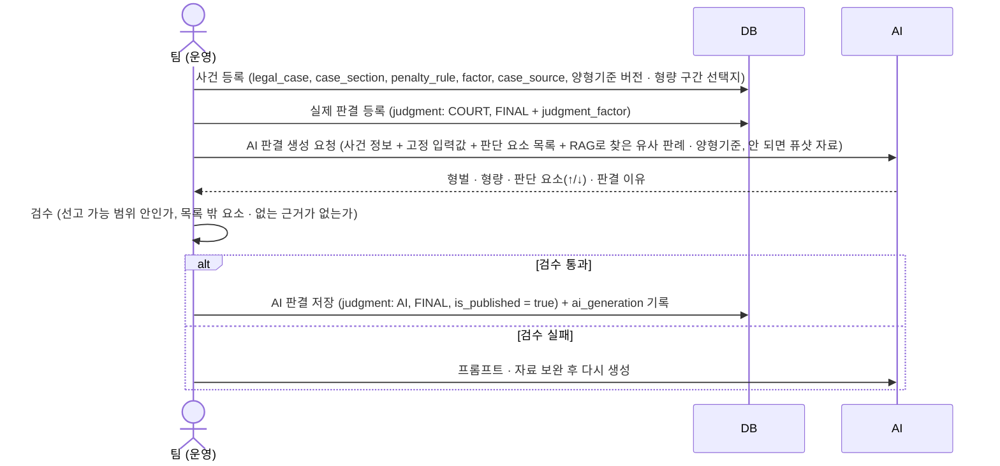
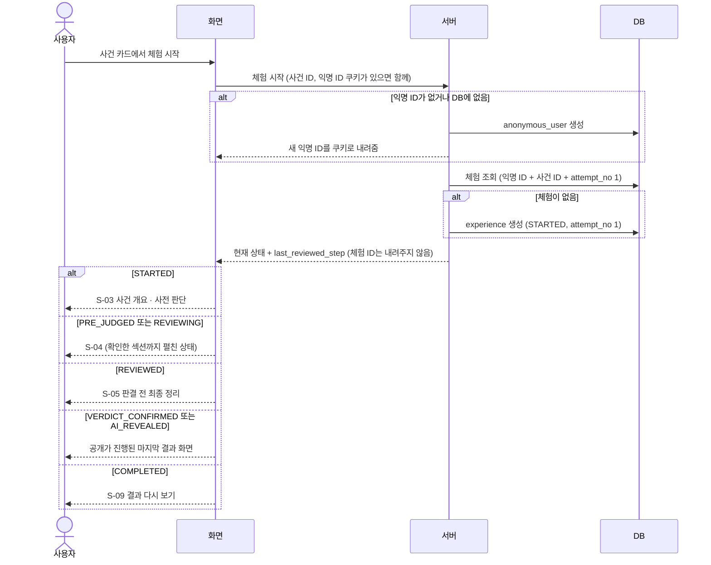
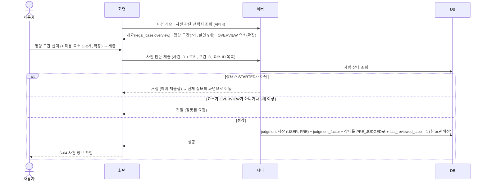
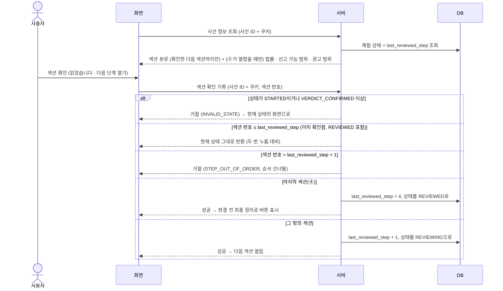
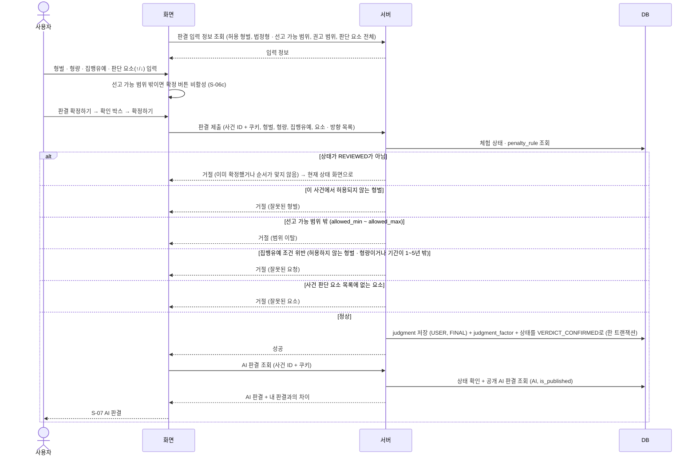
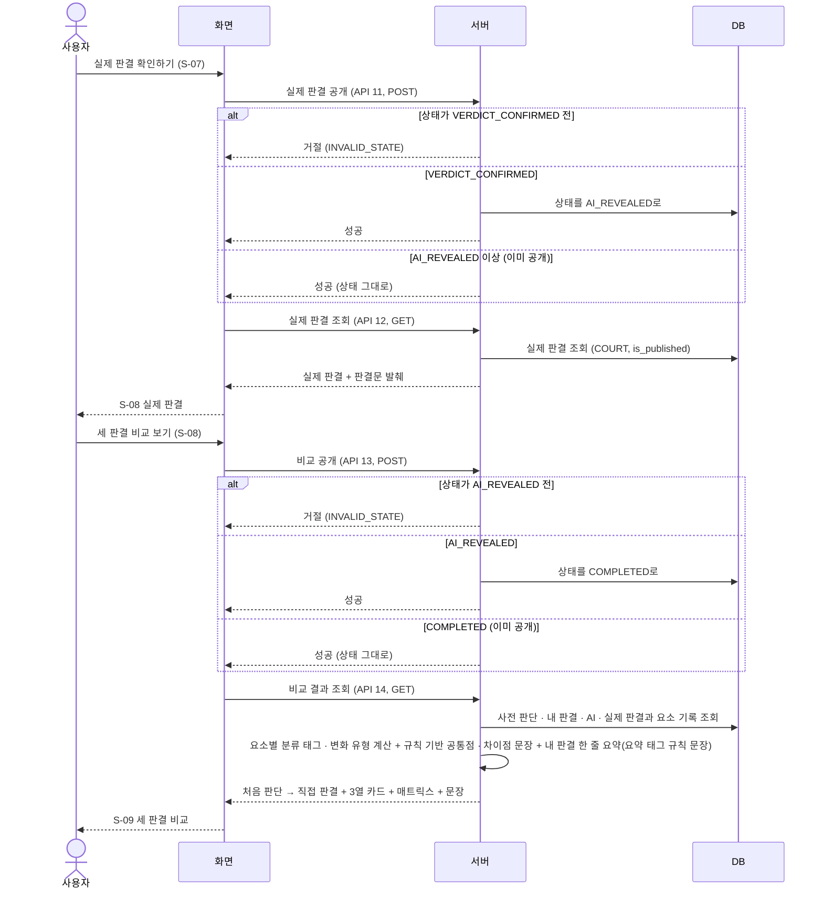
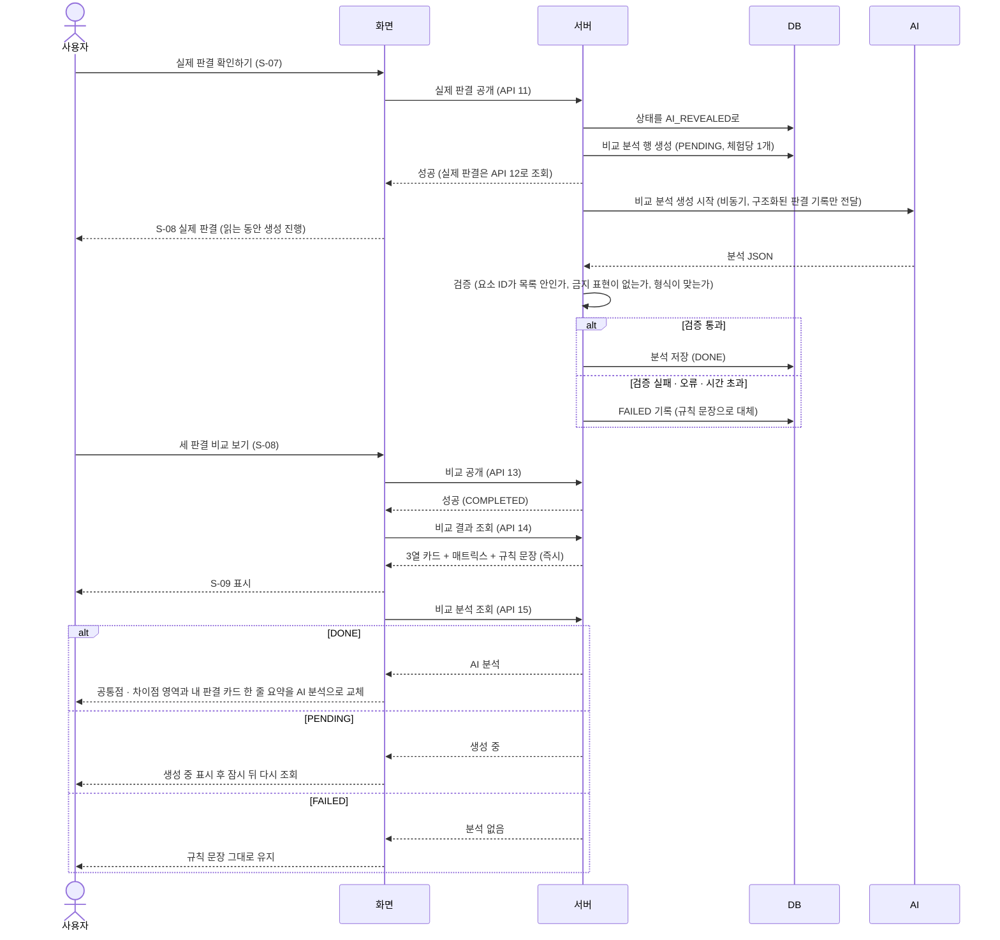

**작성 이력**

| 버전 | 날짜 | 내용 |
| --- | --- | --- |
| v0.1 | 2026-09-28 | 초안 • 사건 등록 · AI 판결 사전 생성, 체험 시작, 사전 판단, 사건 정보 확인, 판결 확정, 결과 공개 · 비교 6개 흐름과 (확장) 비교 분석 생성 시점 2안, API 후보 목록 |
| **v0.2** | **2026-09-28** | 비교 분석 생성 시점 확정 • 안 B(실시간 생성) 채택 • 8장을 안 B 흐름(S-08 진입 시 비동기 생성, S-09는 규칙 문장 먼저 표시)과 안전장치 6개로 교체 • API 후보 15번(비교 분석 조회) 추가 |
| **v0.4** | **2026-09-29** | **문서 정합성 점검 결정 반영 (COMMON-4)** • 체험 ID를 주고받는 표현을 "사건 ID + 익명 ID 쿠키"로 정정(API 1-3) • 화면 진입 시 상태를 먼저 조회하지 않고 각 API의 `INVALID_STATE`로 이동(API 6장 #1 확정, 3장 비고) • 무죄 선택지 MVP 제외(6장) • AI 판결 생성은 RAG 우선, 안 되면 퓨샷(1 · 2장) • S-09 "내 판결" 한 줄 요약: MVP는 요약 태그 규칙 문장, 확장은 비교 분석의 AI 요약으로 교체(7 · 8장) • (낮음 항목) 안전장치 #3의 톤 규칙 참조를 요구사항 11장 · FR-6-3으로 정정 |
| v0.3 | 2026-09-28 | API 명세서 v0.2와 맞춤 • 체험 시작 후 REVIEWED는 S-05로, 섹션 확인 분기(이미 확인한 섹션은 현재 상태 반환 · 건너뛰면 거절 · 확정 후는 거절), 사전 판단 시 last_reviewed_step = 1 • S-05도 사건 정보 조회 • 7장을 공개(POST) · 조회(GET) 두 단계로 다시 그림 • 집행유예 검사 조건 보완 • 사건 등록 대상 테이블 보완 • 후보 8 · 9 허용 상태 정정 |
| v0.5 | 2026-09-30 | 무기징역 · 사형 형벌 추가 (BE-2) — 사전 판단 형량 구간 표기(7개, 살인 9개) |

---

## 1. 등장 요소

| 이름 | 설명 |
| --- | --- |
| 사용자 | 체험하는 사람 (로그인 없음, MVP) |
| 화면 | 프론트엔드 (S-01 ~ S-09) |
| 서버 | Spring Boot API 서버. 모든 순서·수정 불가·범위 규칙은 여기서 검사한다 |
| DB | ERD의 테이블 |
| 팀 (운영) | 사건 데이터와 AI 판결을 준비하는 우리 팀. MVP에서는 별도 관리자 화면 없이 스크립트 · SQL로 넣는다 |
| AI | LLM (요구사항 FR-4-2 · 4-3). 유사 판례 · 양형기준은 **RAG로 검색해 넣고, RAG를 적용할 수 없으면 자료를 프롬프트에 직접 넣는 퓨샷 방식**을 쓴다. AI 판결은 사용자 요청 중에 호출하지 않는다. (확장) 비교 분석만 체험별로 호출한다(8장) |

**AI 판결 생성 시점은 이미 확정돼 있다.** 요구사항 FR-4-6에 따라 AI 판결은 사건 등록 단계에서 미리 만들고 팀이 검수한 뒤 공개한다. 모든 사용자가 같은 AI 판결을 보며, 사용자 요청 중에 AI를 부르지 않는다. 예외는 **세 판결 비교 분석(FR-6-3, 확장)** 으로, 체험별로 실시간 생성한다(8장, v0.2 확정).

---

## 2. 사건 등록 · AI 판결 사전 생성 (운영, 체험 전)

- AI에는 실제 판결 결과를 주지 않는다. 유사 판례 자료에서도 대상 사건은 뺀다(FR-4-2).
- 공개 AI 판결은 사건당 1개(`is_published = true`). 다시 만들면 새 행을 만들고 공개 대상을 교체한다(FR-4-6, ERD `ai_generation`).

---

## 3. 체험 시작 (S-02 → S-03)

- 사건 ID가 없거나 공개되지 않은 사건이면 404 → S-14.
- 같은 사건을 두 번 눌러도 체험은 하나만 생긴다. DB 유니크 제약(`anonymous_user_id`, `case_id`, `attempt_no`)으로 동시 요청까지 막는다.
- 이 응답의 "현재 상태 → 화면" 규칙은 **모든 화면 진입 시 공통**이다. 화면은 진입할 때 상태를 따로 조회하지 않고 그 화면의 API를 바로 부른다. 허용되지 않은 화면이면 API가 `409 INVALID_STATE` + `currentStatus`를 돌려주고, 화면은 이 규칙대로 보낸다(API 1-6 · 6장 #1 확정, IA 5장).
- 이후 요청은 모두 **사건 ID + 익명 ID 쿠키**로 체험을 찾는다. 화면은 체험 ID를 들고 다니지 않는다(API 1-3).

---

## 4. 사전 판단 (S-03)

- 상태 변경은 조건부로 한다: "상태가 `STARTED`일 때만 `PRE_JUDGED`로 바꾼다". 두 번 눌러 요청이 동시에 와도 하나만 성공한다.
- S-03에서 받는 데이터에는 법정형 · 권고 범위 · 실제 판결이 없다.

---

## 5. 사건 정보 확인 (S-04)

- 새로고침하면 첫 조회 결과의 `last_reviewed_step`으로 펼침 상태를 복원한다(FR-2-11).
- 섹션 ①(개요)은 S-03에서 이미 봤으므로 확인 완료로 시작한다. 번호는 ① = 1 ~ ④ = 4이고, 사전 판단을 제출하면 `last_reviewed_step`이 1이 된다(API 5).
- 잠긴 섹션 본문은 응답에 넣지 않는다. 화면에서만 숨기면 개발자 도구로 볼 수 있다.
- S-05 판결 전 최종 정리도 사건 정보 조회(API 6)를 부른다. `REVIEWED`이면 S-05용 핵심 사실 요약(`SUMMARY`)이 함께 내려온다. 새로고침해도 같은 요청으로 다시 그린다.

---

## 6. 판결 확정 (S-06 → S-07)

- **AI는 여기서 호출하지 않는다.** 2장에서 미리 만든 판결을 DB에서 읽기만 한다. 응답이 빠르고 모든 사용자에게 같다.
- 화면의 버튼 비활성은 편의 기능이고, 진짜 검사는 서버에서 한다(FR-3-3).
- 무죄는 MVP 선택지에서 뺐다(요구사항 15장, v0.4). 무죄가 오면 `penalty_rule`에 없는 형벌이라 "허용되지 않는 형벌"로 거절된다.
- "내 판결과의 차이" 문구 생성 로직은 미정(요구사항 15장). MVP는 형량 차이만 계산해 돌려준다.

---

## 7. 결과 공개 · 비교 (S-07 → S-08 → S-09)

상태를 바꾸는 **공개**(POST)와 결과를 읽는 **조회**(GET)를 나눈다(API 11 ~ 14). 결과 화면을 새로고침하면 조회만 다시 부른다.

- 공개 요청은 **다시 보내도 결과가 같아야 한다**(이미 공개된 상태면 상태는 그대로 두고 결과만 돌려준다). 결과 화면끼리 오가거나 새로고침해도 거절되지 않는다.
- 사전 판단은 이 응답에서 처음 내려간다. 그 전의 어떤 응답에도 넣지 않는다(IA 결정 2).
- MVP의 공통점 · 차이점은 매트릭스를 바탕으로 한 규칙 문장이라 AI를 부르지 않는다(IA S-09).
- 3열 판결 카드의 한 줄 요약: AI · 재판부는 팀이 등록한 `judgment.summary`를 읽고, 내 판결은 사용자가 고른 요소의 요약 태그(`factor.summary_tag`)를 방향별로 모아 서버가 규칙 문장으로 만든다(ERD 6장, API 판결 응답 공통 형식). MVP에서는 AI를 부르지 않는다.

---

## 8. (확장) 세 판결 비교 분석 — 실시간 생성 (안 B 확정)

비교 분석(FR-6-3)은 **사용자 판결이 사람마다 달라서 사건 등록 때 전부 미리 만들 수 없다.** 두 안(A: AI ↔ 실제 분석만 미리 만들고 내 판결 부분은 규칙 문장 / B: 체험별 실시간 생성)을 비교한 뒤, 팀 논의로 **안 B를 채택했다**(v0.2).

안 B는 검수 없이 문장이 나가므로 FR-4-6(검수한 결과만 공개)의 예외가 된다. 그래서 아래 **안전장치를 함께 둔다.**

### 흐름

- **생성 시작은 S-08 진입 시점**(`AI_REVEALED`)이다. 사용자가 실제 판결을 읽는 동안 만들어 두므로, S-09를 열 때 기다리는 시간이 거의 없다.
- **S-09는 AI를 기다리지 않는다.** 매트릭스와 MVP의 규칙 문장을 먼저 보여 주고, 분석이 준비되면 공통점 · 차이점 영역만 바꾼다. AI가 실패해도 화면은 MVP와 같게 동작한다.
- 같은 체험의 분석은 **한 번만 만든다.** 결과 화면을 다시 열거나 새로고침해도 저장된 분석을 보여 준다(재생성 없음).
- **AI "내 판결" 요약(확장, REQ-062)**: 분석 결과의 `perspectives.USER`가 사용자가 입력한 형벌 · 형량 · 판단 요소 · 방향을 바탕으로 만든 내 판결 요약이다. 같은 생성 호출 · 같은 안전장치를 쓰고, `DONE`이면 S-09 내 판결 카드의 한 줄 요약(MVP 규칙 문장)을 이 문장으로 바꾼다. 실패하거나 생성 중이면 규칙 문장을 그대로 둔다.

### 안전장치

| # | 장치 | 내용 |
| --- | --- | --- |
| 1 | 입력 제한 | 세 판결의 형벌 · 형량 · 판단 요소 기록(요소 ID · 문구 · 방향), 사전 판단 구간, 요소의 공개 단계만 넣는다. 사건 원문과 실제 판결문 전문은 넣지 않는다. (확장) 사용자의 추가 판단 이유(자유 입력)는 넣지 않거나, 넣을 때는 지시문으로 해석되지 않도록 분리한다 |
| 2 | 출력 형식 고정 | 항목마다 근거가 된 요소 ID를 붙인 JSON으로 받는다. 서버가 사건 판단 요소 목록에 없는 ID를 거절한다 → 없는 사실 · 근거를 만들기 어렵게 한다 |
| 3 | 표현 검사 | "정답", "옳다 · 틀렸다", "이중 잣대", 점수 · 순위 표현이 있으면 실패로 처리한다(요구사항 11장 톤 원칙 · FR-6-3) |
| 4 | 대체 문장 | 검증 실패 · AI 오류 · 시간 초과(기준은 기술 설계에서 정함) 시 MVP의 규칙 문장을 그대로 쓴다 |
| 5 | 한 번만 생성 | 체험당 분석 1개(유니크 제약). 동시 요청이 와도 하나만 생성한다 |
| 6 | 기록 · 사후 점검 | 입력 · 원본 출력 · 모델 · 프롬프트 버전을 저장하고, 팀이 주기적으로 샘플을 점검한다. 문제가 반복되면 프롬프트를 고치고 버전을 올린다 |