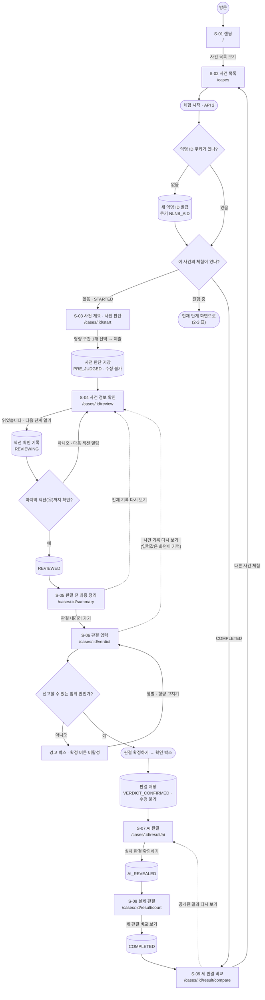
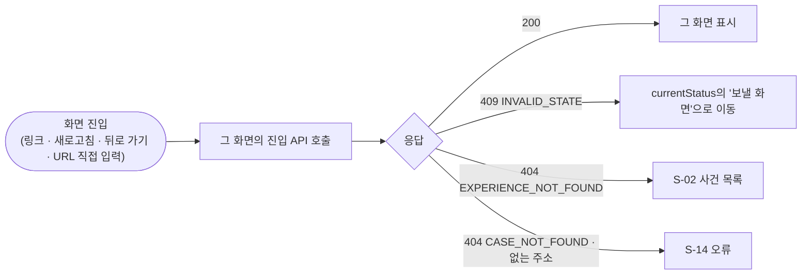
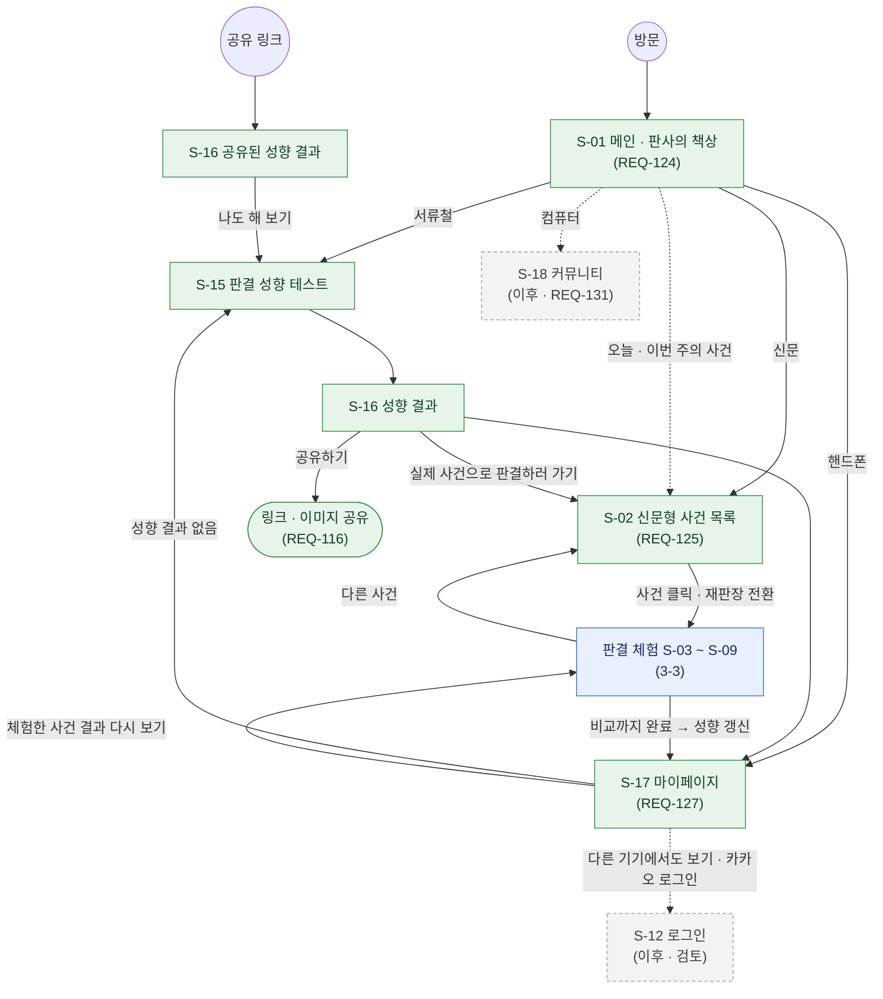
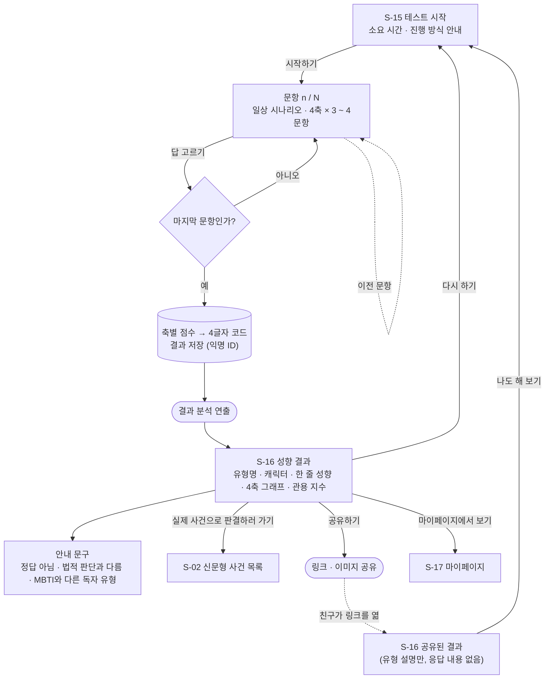
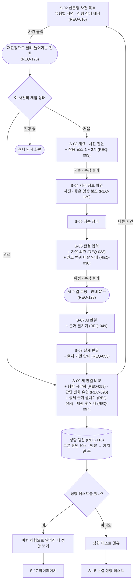
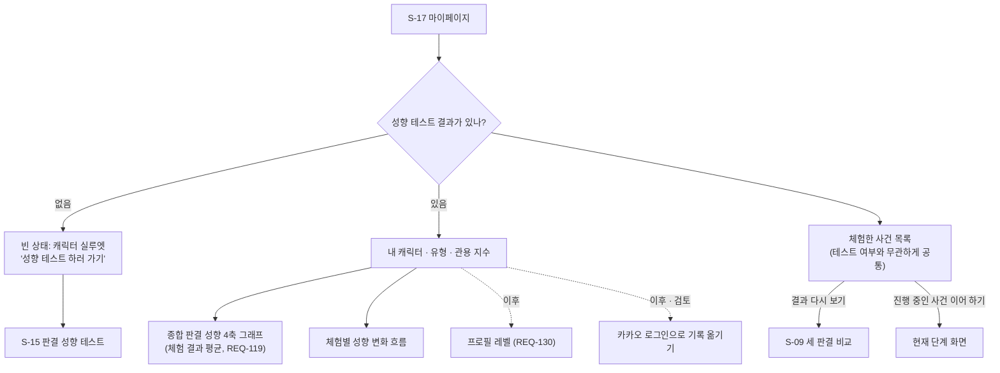
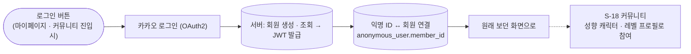
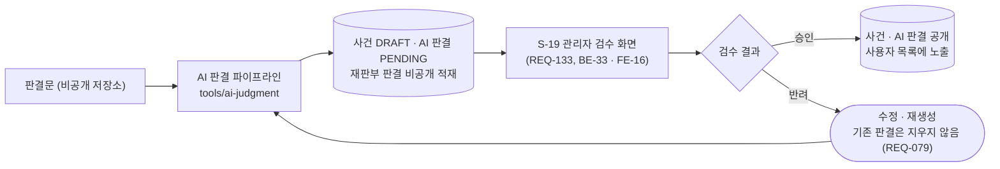

# 유저 흐름도 (User Flow)

**작성 이력**

| 버전 | 날짜 | 내용 |
| --- | --- | --- |
| v1.0 | 2026-10-08 | 초안 (COMMON-20) • MVP 구현 기준 흐름(2장): 화면 이동 · 분기 · 서버 저장 시점 · 재진입 · 예외 이동 • 11차 회의(MVP 이후 확장 계획) · 12차 회의(판결 성향 테스트 · 판사의 책상 메인 · AI 활용)를 반영한 확장 목표 흐름(3장) • 흐름 관련 미결정 사항(4장). 성향 그래프는 4축으로 확정 |

**기준**: 코드 `develop` 0ac871a(MVP 구현 완료) · 정보 구조(`information-architecture.md`) v1.11 · 기능 명세(`functional-specification.md`) v3.5 · 요구사항(`requirements-specification.md`) v5.8 · API 명세(`api-specification.md`) v0.14

> 이 문서는 사용자가 **무엇을 보고, 무엇을 고르고, 어디로 가는지**를 흐름으로 보여 준다. 화면 구성 · 진입 조건 · 체험 상태 규칙의 원본은 정보 구조이고, 내용이 다르면 정보 구조가 우선한다.
> 2장은 **구현된 MVP**, 3장은 회의에서 정한 **확장 목표안**이다. 3장의 새 화면 ID(S-15 ~ S-19)와 경로는 제안이며, 상세 설계에서 바뀔 수 있다.

---

## 0. 읽는 법

| 모양 | 뜻 |
| --- | --- |
| 사각형 `S-xx` | 화면 |
| 둥근 사각형 | 사용자 행동 · 버튼 · 화면 연출 |
| 마름모 | 분기 (시스템 판단 또는 사용자 선택) |
| 원통 | 서버에 저장되는 시점 (체험 상태 변경 포함) |
| 실선 화살표 | 기본 흐름 |
| 점선 화살표 | 선택 이동 · 되돌아보기 · 예외 이동 |

3장 그림의 색: **파랑** = MVP(구현 완료) · **초록** = 확장(3 ~ 6주차) · **회색 점선** = 이후 단계 또는 검토 중

---

## 1. 사용자와 진입 경로

| 사용자 | 들어오는 길 | 처음 도착하는 곳 | 단계 |
| --- | --- | --- | --- |
| 처음 온 사용자 | 주소 직접 입력 · 검색 · 홍보 링크 | S-01 랜딩 → (확장) 판사의 책상 메인 | MVP / 확장 |
| 다시 온 사용자 (같은 브라우저) | 익명 ID 쿠키(`NLNB_AID`)가 남아 있음 | 사건을 누르면 그 사건의 현재 진행 단계 화면 | MVP |
| 쿠키를 지웠거나 브라우저를 바꾼 사용자 | 쿠키 없음 → 새 익명 ID | 처음 온 사용자와 같음. 이전 진행은 이어갈 수 없음(안내는 REQ-108, 확장) | MVP / 확장 |
| 공유 링크로 온 사용자 | 친구가 공유한 성향 결과 링크 | 공유된 결과 → 성향 테스트 시작 | 확장 (REQ-116) |
| 로그인 회원 | 카카오 로그인 | 마이페이지 · 커뮤니티 | 이후 (검토 중, REQ-066 · 067) |
| 관리자 | 관리자 로그인 | 사건 · AI 판결 검수 화면 | 확장 (REQ-133, BE-33 · FE-16) |

---

## 2. MVP 흐름 (구현 완료)

로그인 없이 **대표 사건 1건**으로 랜딩부터 세 판결 비교까지 끝까지 진행한다. 진행 상태는 서버에 저장되고(익명 ID × 사건), 앞으로만 이동한다.

### 2-1. 전체 흐름

### 2-2. 화면별 사용자 행동

| 진행 | 화면 | 사용자가 보는 것 | 사용자가 하는 것 | 서버 처리 | 다음 화면 |
| --- | --- | --- | --- | --- | --- |
| — | S-01 랜딩 | 서비스 소개, 특징 카드 3개, 법적 고지 | `사건 목록 보기` | — | S-02 |
| — | S-02 사건 목록 | 사건 카드(이미지 · 유형 · 제목 · 소개 · 참여자 수) | `체험 시작` | API 1 목록, API 2 체험 시작(익명 ID 발급 · 기존 체험 조회) | 상태별 화면(처음이면 S-03) |
| 1 / 6 | S-03 개요 · 사전 판단 | 뉴스 수준 개요, "지금은 뉴스에서 볼 수 있는 정도의 정보만 있어요" 안내, 형량 구간 7개(살인 8개) | 구간 1개 선택 → `판단 제출하고 사건 자세히 보기` | API 4 조회, API 5 제출 → `PRE_JUDGED` | S-04 |
| 2 ~ 4 / 6 | S-04 사건 정보 확인 | 아코디언 ① 개요(접힘) ② 상세 사실관계 ③ 양측 주장 ④ 법률 · 양형기준. 잠긴 섹션은 "이전 단계 확인 후 열립니다" | 섹션마다 `읽었습니다 · 다음 단계 열기` | API 6 조회(잠긴 섹션 본문 없음), API 7 확인 기록 → `REVIEWING` → 마지막이면 `REVIEWED` | 다음 섹션 → S-05 |
| 5 / 6 | S-05 최종 정리 | 개요 · 핵심 사실 · 양측 주장 · 법정형 · 선고 가능 범위 · 권고 범위 | `판결 내리러 가기` 또는 `전체 기록 다시 보기` | API 6 (summary 포함) | S-06 / S-04 |
| (6) | S-06 판결 입력 | 형벌 종류(법정형에 있는 것만), 형량 · 권고 범위 막대, 집행유예, 판단 요소 목록 ↑/↓ | 형벌 · 형량 입력 → 요소 선택 · 방향 표시 → `판결 확정하기` → 확인 박스 | API 8 조회, API 9 제출(선고 가능 범위 서버 검증) → `VERDICT_CONFIRMED` | S-07 |
| 공개 2 / 3 | S-07 AI 판결 | AI 형벌 · 형량, 내 판결과의 차이, 참고 자료 태그, 판단 근거 | `실제 판결 확인하기` | API 10 조회, API 11 공개 → `AI_REVEALED` | S-08 |
| 공개 3 / 3 | S-08 실제 판결 | 실제 형량 배너, 재판부 판단 근거, 판결문 발췌 + 쉽게 말하면 | `세 판결 비교 보기` | API 12 조회, API 13 공개 → `COMPLETED` | S-09 |
| 완료 | S-09 세 판결 비교 | 처음 판단 → 직접 판결, 3열 판결 카드 + 한 줄 요약, 판단 요소 매트릭스 · 분류 태그, 공통점 · 차이점 규칙 문장 | `다른 사건 체험` | API 14 조회 | S-02 |
| — | S-14 오류 | "찾을 수 없어요" | 목록 · 홈으로 | — | S-02 / S-01 |

### 2-3. 다시 들어오거나 흐름을 벗어났을 때

화면은 들어올 때 상태를 따로 묻지 않고 **그 화면의 API를 바로 부른다.** 허용되지 않은 화면이면 API가 알려 준 현재 상태로 보낸다(API 1-6, IA 9장).

| 현재 상태 | 보낼 화면 | 이 상태에서 열 수 있는 화면 |
| --- | --- | --- |
| `STARTED` | S-03 | S-03 |
| `PRE_JUDGED` · `REVIEWING` | S-04 | S-04 |
| `REVIEWED` | S-05 | S-04 · S-05 · S-06 |
| `VERDICT_CONFIRMED` | S-07 | S-07 |
| `AI_REVEALED` | S-08 | S-07 · S-08 |
| `COMPLETED` | S-09 | S-07 · S-08 · S-09 |

| 상황 | 결과 |
| --- | --- |
| 사전 판단 제출 뒤 뒤로 가기로 S-03에 들어옴 | 현재 상태 화면(S-04 등)으로 이동. 사전 판단은 바꿀 수 없음 |
| S-04에서 새로고침 | 확인한 섹션과 그다음 섹션까지 펼친 상태로 복원 |
| `REVIEWED` 전에 S-05 · S-06 주소를 직접 입력 | S-04로 이동 |
| S-06 입력 중 새로고침 | 빈 입력 화면으로 다시 열림(임시 저장은 이후 단계 REQ-039) |
| S-06에서 S-04를 보고 돌아옴 | 입력값을 화면(브라우저 메모리)이 기억해 복원 |
| 판결 확정 뒤 S-04 ~ S-06에 들어옴 | 공개가 진행된 가장 마지막 결과 화면으로 이동 |
| AI 판결을 보기 전에 S-08 주소를 입력 | S-07로 이동(AI → 실제 순서 유지) |
| 완료한 사건을 목록에서 다시 누름 | S-09 결과 다시 보기. 같은 사건 재체험은 없음(이후 단계 REQ-110) |
| 쿠키를 지우고 다시 옴 | 새 익명 ID로 처음부터. 이전 진행은 찾을 수 없음 |

### 2-4. MVP 흐름에서 지키는 규칙

- 실제 판결은 S-08 전까지 목록 · 개요 · 키워드 어디에도 드러나지 않는다.
- 사전 판단과 최종 판결은 제출 · 확정 뒤 어떤 경로로도 바꿀 수 없다(서버가 막음).
- S-04 섹션은 순서대로만 열리고, 잠긴 섹션 본문은 응답에 없다.
- 선고할 수 있는 범위 밖 형량은 화면에서 확정할 수 없고, API로 보내도 거절된다.
- 같은 브라우저에서 사건당 한 번만 체험한다.

---

## 3. 확장 목표 흐름 (11 · 12차 회의)

### 3-0. MVP와 무엇이 달라지나

| 구분 | 내용 | 근거 |
| --- | --- | --- |
| 입구가 둘이 된다 | **판결 성향 테스트**(가볍게 시작하는 마중물) + **판결 체험**(핵심 경험). 테스트 결과 화면에서 "실제 사건으로 판결하러 가기"로 판결 체험에 이어진다 | 12차 기획 |
| 메인이 바뀐다 | **판사의 책상**(공간 메타포): 서류철 = 성향 테스트, 신문 = 판결 체험, 핸드폰 = 마이페이지, 컴퓨터 = 커뮤니티(이후) | 12차 디자인 · REQ-124 |
| 사건 목록이 신문이 된다 | 지면 신문 디자인, 사건을 유형별 지면에 배치. 사건을 누르면 재판장으로 빨려 들어가는 전환 | REQ-125 · 126 |
| 체험이 성향을 바꾼다 | 판결 체험에서 고른 판단 요소 · 방향을 가치관 축에 반영해 내 성향을 갱신하고, 마이페이지에서 성향 변화와 종합 성향(4축 그래프)을 본다 | REQ-118 · 119 · 127 |
| AI 판결 공개 전 연출 | 판결 확정 뒤 AI 판결 화면 전에 로딩 · 안내 문구 | 멘토 · FT 피드백, REQ-128 |
| 빠지는 것 | AI 비교 분석 실시간 생성(REQ-062 · 063) — S-08에서 분석 생성을 시작하지 않고, S-09의 공통점 · 차이점과 내 판결 한 줄 요약은 규칙 문장을 그대로 쓴다 | 11차 회의 |

### 3-1. 전체 지도

### 3-2. 판결 성향 테스트 (S-15 · S-16)

일상 가치관 4축(사과와 진정성 · 잘잘못의 기준 · 원칙과 관계 · 질서와 기회)을 일상 시나리오 문항으로 재고, 4글자 코드 16유형(수식어 + 동물 이름)으로 보여 준다. 문항에는 법률 용어를 쓰지 않는다.

| 결과 화면 요소 | 내용 | REQ |
| --- | --- | --- |
| 유형 | 4글자 코드 + 유형명(예: 너그러운 판다형) + 캐릭터 이미지 | 113 |
| 한 줄 성향 · 4축 그래프 | 가치관 4축마다 양쪽 성향의 비중(예: E 행동증명형 ↔ I 마음신뢰형) | 113 |
| 관용 지수 | I · N · F · P 글자 개수(0 ~ 4) 게이지. 높을수록 좋은 것이 아니라고 함께 안내 | 113 · 114 |
| 안내 | 어느 유형이 옳다는 뜻이 아님, 일상 가치관 기준이라 법적 판단과 다름, 실제 MBTI와 일치하지 않을 수 있음. 화면 · 홍보 문구에 "MBTI"를 쓰지 않고 "4글자 판결 성향 유형"으로 표기 | 114 |
| 다음 행동 | **실제 사건으로 판결하러 가기**(주 버튼) · 공유하기 · 다시 하기 · 마이페이지 | 115 · 116 · 127 |

> 테스트는 판결 체험과 달리 **결과 전까지 이전 문항으로 돌아가 답을 바꿀 수 있다**(제안). 수정 불가 원칙은 사전 판단 · 판결에만 적용한다.

### 3-3. 판결 체험 (확장판)

흐름과 상태 규칙은 2장과 같다. 화면마다 확장 기능이 붙고, 비교 뒤에 성향 갱신이 이어진다.

| 화면 | 확장에서 더하는 것 | REQ |
| --- | --- | --- |
| S-02 | 신문 지면 디자인, 사건 유형별 배치, 내 진행 상태 배지, (이후) 오늘 · 이번 주의 사건 | 125 · 010 · 132 |
| S-02 → S-03 | 재판장 진입 전환 연출 | 126 |
| S-03 | 사전 판단 작용 요소 1 ~ 2개 선택 | 093 |
| S-04 ~ S-05 | 글 위주 정보에 사진 · 일러스트 · 짧은 영상 보조(사건을 특정할 수 없는 범위) | 129 |
| S-06 | 자유 의견, 권고 범위 이탈 안내(확정은 막지 않음) | 033 · 036 |
| S-06 → S-07 | AI 판결 로딩 · 안내 문구(미리 만든 판결이며 내 판결 · 실제 판결을 보지 않았다는 점, 법률 자문이 아니라는 점) | 128 |
| S-07 | 유사 판례 · 양형인자 판단 과정 펼치기 | 049 |
| S-08 | 실제 판례 기반 · 출처 기관 안내 | 055 |
| S-09 | 형량 비교 시각화, 판단 이유 변화 유형, 상세 근거 펼치기, 체험 후 안내 | 059 · 096 · 064 · 097 |
| S-09 뒤 | 성향 갱신 → 마이페이지 / 성향 테스트 권유 | 118 · 119 |
| 공통 | 모바일 완전 대응, 쿠키 삭제 시 안내, 이용약관 · 개인정보처리방침 | 004 · 108 · 072 · 073 |

### 3-4. 마이페이지 (S-17)

- 로그인 전에는 **익명 ID 기준**으로 보여 준다. 쿠키를 지우면 마이페이지 기록도 찾을 수 없다(REQ-108 안내 대상).
- 판결 체험만 하고 성향 테스트를 하지 않은 사용자도 체험한 사건 목록은 볼 수 있다. 성향 영역은 테스트 권유로 채운다.
- 성향 그래프는 **4축 그래프**다. 가치관 4축마다 양쪽 성향의 비중을 보여 준다(육각형 그래프는 쓰지 않음).

### 3-5. 로그인 · 커뮤니티 (이후 · 검토 중)

11차 회의에서 제안된 항목이다. 범위와 시점은 아직 정하지 않았다(요구사항 15장).

### 3-6. 관리자 (확장)

사용자 흐름은 아니지만, 사건과 AI 판결이 사용자에게 보이기까지의 흐름이다. 자동 파이프라인(BE-30 ~ 45, [ai-judgment-pipeline.md](ai-judgment-pipeline.md))이 비공개로 적재하고, 관리자가 검수해 공개한다(후검수, REQ-047 · 075 · 078).

| 파이프라인 단계 | 퓨샷 | 임베딩 | RAG | 검수 화면에서 보여 줄 것 |
| --- | --- | --- | --- | --- |
| ① 비식별화 · 구조화 (extract) | ✅ | ✅ 요약어 후보 | — | 요약어 후보와 점수 |
| ② 재판부 판결 초안 (court) | ✅ | — | — | 원문 인용 검사 결과 |
| ③ 사전 학습 점검 (contamination) | — | — | — | 모델별 판정 |
| ④ AI 판결 생성 (generate) | ✅ | 검색용 | ✅ 유사 판례 · 발생 시점 양형기준 | 넣은 참고 자료(`input_snapshot`) |
| ⑤ 회차 선택 (select) | — | ✅ 판결 이유 유사도 | — | 선택 근거 · 이상 회차 표시 |
| ⑥ 적재 (load) · ⑦ 후검수 | — | — | — | — |

> 위 표는 12차 회의에서 정한 **적용 위치**다(구현 전). 임베딩 모델, 판례 · 양형기준 저장소 범위, 점수 하한은 아직 정하지 않았다(요구사항 15장).

### 3-7. 화면 대응 (MVP → 확장)

| 화면 ID | MVP | 확장 목표 | 경로 (제안) | 단계 |
| --- | --- | --- | --- | --- |
| S-01 | 랜딩 / 홈 | **판사의 책상 메인** (서비스 4개 진입) | `/` | 확장 |
| S-02 | 그리드 카드 사건 목록 | **신문형 사건 목록** | `/cases` | 확장 |
| S-03 ~ S-09 | 판결 체험 | 같은 흐름 + 재판장 테마 디자인 · 확장 기능 | 그대로 | 확장 |
| S-12 | 로그인 / 회원가입 | 카카오 로그인 | `/login` | 이후 (검토) |
| S-13 | 내 기록 | S-17 마이페이지의 "체험한 사건" 영역으로 합침 | — | — |
| **S-15** | — | 판결 성향 테스트 (시작 · 문항) | `/test` | 확장 |
| **S-16** | — | 성향 결과 (내 결과 · 공유된 결과) | `/test/result`, `/test/types/:code` | 확장 |
| **S-17** | — | 마이페이지 | `/me` | 확장 |
| **S-18** | — | 커뮤니티 | `/community` | 이후 (검토) |
| **S-19** | — | 관리자 사건 · AI 판결 검수 | `/admin` | 확장 (관리자 전용) |

---

## 4. 흐름 관련 미결정 사항

| # | 내용 | 제안 | 영향 |
| --- | --- | --- | --- |
| 1 | 성향 테스트 없이 판결 체험만 한 사용자의 성향 갱신 | 체험별 기여분을 저장해 두고, 테스트를 마치면 함께 반영 | REQ-117 · 118, ERD 8장 |
| 2 | 성향 갱신 시점과 산식 | `COMPLETED`가 될 때 한 번. 판단 요소 방향 → 축 점수 매핑은 요소별 축(`factor.value_axis`, BE-47 · 48 · 49 · 43)을 쓰고 축마다 방향 → 글자 산식으로 상세 설계 | REQ-118 |
| 3 | 테스트 다시 하기 | 새 결과를 현재 결과로 쓰고 이전 결과는 이력으로 남김 | REQ-117 |
| 4 | 성향 결과 저장 주체 | 로그인 전에는 익명 ID. 쿠키 삭제 시 유실되므로 로그인 도입 시점과 함께 정한다 | REQ-066 · 067 · 117 |
| 5 | 공유 링크 내용 | 유형 설명만 담은 공개 페이지(`/test/types/:code`). 개인 응답 · 체험 기록은 담지 않는다 | REQ-116 |
| 6 | 판결 체험 중 성향 테스트로 이동 | S-03 ~ S-08 중에는 권유하지 않고 S-09 뒤에만 권유(독립 판단 보호) | REQ-115 · 118 |
| 7 | AI 판결 로딩 연출 길이 · 문구 | AI 판결은 미리 만든 것이라 실제 대기가 없다. 연출이 판결을 지금 만드는 것처럼 오해되지 않게 쓴다 | REQ-128 |
| 8 | REQ-106 · 107 처리 | AI 비교 분석(REQ-063)이 빠지면서 대상이 사라졌다. 다른 실시간 AI 기능이 생길 때 쓸 원칙으로 남길지, 제외할지 정한다 | 기능 명세 |

> 성향 그래프 형태는 **4축 그래프로 확정**해 이 표에서 뺐다(요구사항 15장 확정 표).
